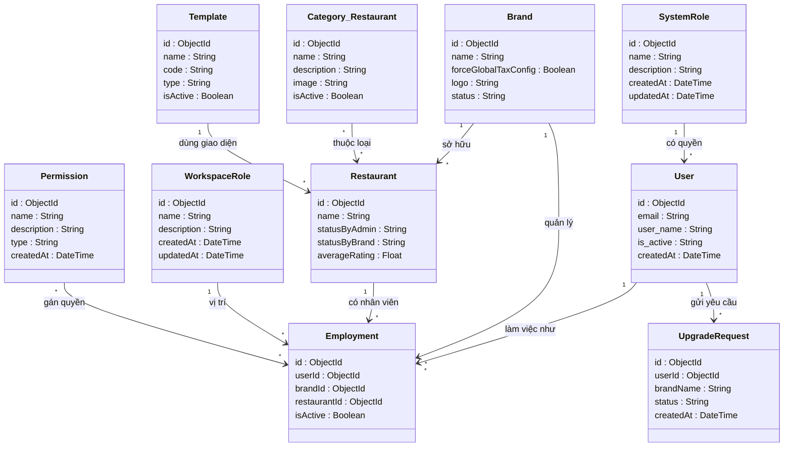
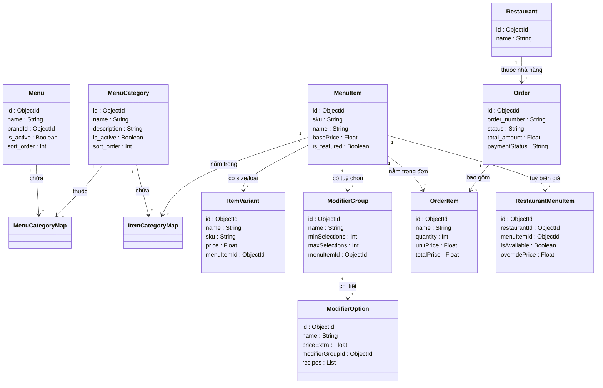
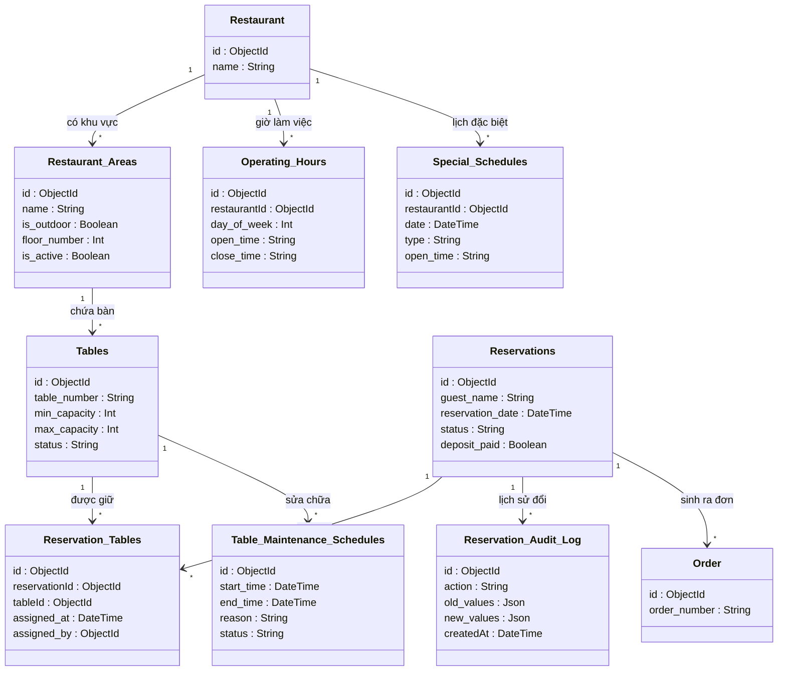
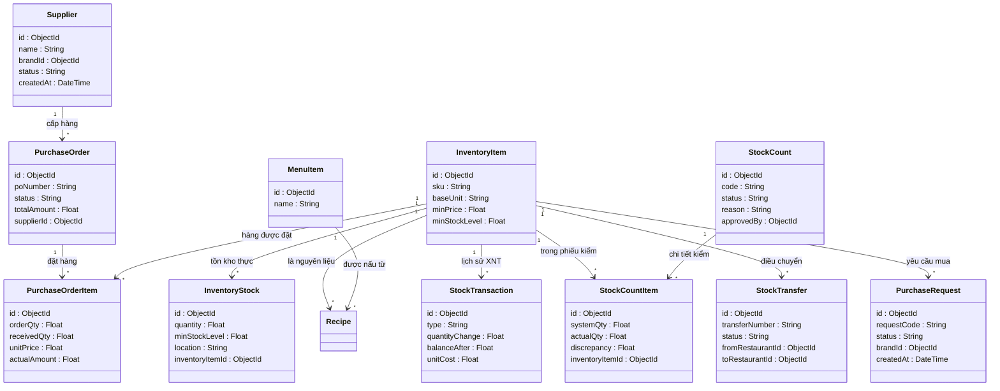

# Hệ Thống Quản Lý Nhà Hàng Đa Điểm (Multi-tenant F&B SaaS)

Chào mừng bạn đến với dự án Quản lý Nhà hàng Đa điểm (Multi-tenant F&B SaaS). Đây là một hệ thống đồ sộ bao phủ mọi nghiệp vụ từ quản lý chuỗi thương hiệu, chi nhánh, nhân sự, kiểm kho, cho đến thanh toán và tích hợp trợ lý ảo AI.

---

## 🌌 Bản Đồ Vũ Trụ (Master Schema - Toàn bộ 73 Bảng)

> [!WARNING]
> Đây là sơ đồ gộp toàn bộ 73 bảng và hàng trăm mối quan hệ vào chung 1 khung hình duy nhất (Master Diagram). Sơ đồ này cực kỳ nặng, vui lòng đợi vài giây để GitHub render.

<details>
<summary><b>🔥 Bấm vào đây để bung lụa toàn bộ Sơ Đồ Tổng Hợp (Vui lòng zoom trên trình duyệt để xem rõ)</b></summary>

```mermaid
classDiagram
    direction TB
    User "1" --> "*" Employment : làm việc như
    SystemRole "1" --> "*" User : có quyền
    Brand "1" --> "*" Restaurant : sở hữu
    Brand "1" --> "*" Employment : quản lý
    Restaurant "1" --> "*" Employment : có nhân viên
    WorkspaceRole "1" --> "*" Employment : vị trí
    Permission "*" --> "*" Employment : gán quyền
    Category_Restaurant "*" --> "*" Restaurant : thuộc loại
    Template "1" --> "*" Restaurant : dùng giao diện
    User "1" --> "*" UpgradeRequest : gửi yêu cầu
    Menu "1" --> "*" MenuCategoryMap : chứa
    MenuCategory "1" --> "*" MenuCategoryMap : thuộc
    MenuCategory "1" --> "*" ItemCategoryMap : chứa
    MenuItem "1" --> "*" ItemCategoryMap : nằm trong
    MenuItem "1" --> "*" ItemVariant : có size/loại
    MenuItem "1" --> "*" ModifierGroup : có tuỳ chọn
    ModifierGroup "1" --> "*" ModifierOption : chi tiết
    MenuItem "1" --> "*" OrderItem : nằm trong đơn
    Order "1" --> "*" OrderItem : bao gồm
    Restaurant "1" --> "*" Order : thuộc nhà hàng
    MenuItem "1" --> "*" RestaurantMenuItem : tuỳ biến giá
    Restaurant "1" --> "*" Restaurant_Areas : có khu vực
    Restaurant_Areas "1" --> "*" Tables : chứa bàn
    Reservations "1" --> "*" Reservation_Tables : giữ bàn
    Tables "1" --> "*" Reservation_Tables : được giữ
    Tables "1" --> "*" Table_Maintenance_Schedules : sửa chữa
    Reservations "1" --> "*" Reservation_Audit_Log : lịch sử đổi
    Reservations "1" --> "*" Order : sinh ra đơn
    Restaurant "1" --> "*" Operating_Hours : giờ làm việc
    Restaurant "1" --> "*" Special_Schedules : lịch đặc biệt
    InventoryItem "1" --> "*" InventoryStock : tồn kho thực
    InventoryItem "1" --> "*" Recipe : là nguyên liệu
    MenuItem "1" --> "*" Recipe : được nấu từ
    InventoryItem "1" --> "*" StockTransaction : lịch sử XNT
    InventoryItem "1" --> "*" StockCountItem : trong phiếu kiểm
    StockCount "1" --> "*" StockCountItem : chi tiết kiểm
    Supplier "1" --> "*" PurchaseOrder : cấp hàng
    PurchaseOrder "1" --> "*" PurchaseOrderItem : đặt hàng
    InventoryItem "1" --> "*" PurchaseOrderItem : hàng được đặt
    InventoryItem "1" --> "*" StockTransfer : điều chuyển
    InventoryItem "1" --> "*" PurchaseRequest : yêu cầu mua
    Promotion "1" --> "*" PromotionUsageLog : đã sử dụng
    Promotion "1" --> "*" UserPromotionWallet : khách lưu ví
    User "1" --> "*" RestaurantCustomer : là khách hàng
    User "1" --> "*" LoyaltyTransaction : tích điểm
    Reservations "1" --> "*" Review_Restaurant : đánh giá
    Restaurant "1" --> "*" Tags : gắn tag
    Restaurant "1" --> "*" Restaurant_Amenities : tiện ích
    Restaurant "1" --> "*" Restaurant_Event : sự kiện
    SystemPaymentMethod "1" --> "*" AdminPaymentConfig : cấu hình gốc
    SystemPaymentMethod "1" --> "*" BrandPaymentConfig : cấu hình brand
    SystemPaymentMethod "1" --> "*" RestaurantPaymentConfig : cấu hình quán
    Brand "1" --> "*" BrandSubscription : đăng ký gói
    SubscriptionPlan "1" --> "*" BrandSubscription : thuộc gói
    BrandSubscription "1" --> "*" Invoice : sinh hoá đơn
    Invoice "1" --> "*" BrandSubscriptionTransaction : chi tiết TT
    Order "1" --> "*" Transaction : giao dịch
    Restaurant "1" --> "*" RestaurantRevenue : ghi nhận DT
    Brand "1" --> "*" BrandRevenue : ghi nhận DT
    SystemPaymentMethod "1" --> "*" SystemWebhookLog : log cổng TT
    SystemPaymentMethod "1" --> "*" SystemRevenue : ghi nhận phí
    AiChatbox "1" --> "*" AiModel : cung cấp
    Brand "1" --> "*" AIBrandConfig : cấu hình AI
    Brand "1" --> "*" AIChatSession : log chat
    AIChatSession "1" --> "*" AIChatMessage : tin nhắn
    Brand "1" --> "*" ApiKey : quản lý key
    Brand "1" --> "*" BrandNotification : thông báo
    Restaurant "1" --> "*" RestaurantNotification : thông báo
    User "1" --> "*" CustomerNotification : thông báo
    SystemRole "1" --> "*" SystemNotification : thông báo chung

    class Brand {
            id : ObjectId
            name : String
            forceGlobalTaxConfig : Boolean
            logo : String
            status : String
        }

    class Restaurant {
            id : ObjectId
            name : String
            statusByAdmin : String
            statusByBrand : String
            averageRating : Float
        }

    class User {
            id : ObjectId
            email : String
            user_name : String
            is_active : String
            createdAt : DateTime
        }

    class Employment {
            id : ObjectId
            userId : ObjectId
            brandId : ObjectId
            restaurantId : ObjectId
            isActive : Boolean
        }

    class SystemRole {
            id : ObjectId
            name : String
            description : String
            createdAt : DateTime
            updatedAt : DateTime
        }

    class WorkspaceRole {
            id : ObjectId
            name : String
            description : String
            createdAt : DateTime
            updatedAt : DateTime
        }

    class Permission {
            id : ObjectId
            name : String
            description : String
            type : String
            createdAt : DateTime
        }

    class Category_Restaurant {
            id : ObjectId
            name : String
            description : String
            image : String
            isActive : Boolean
        }

    class Template {
            id : ObjectId
            name : String
            code : String
            type : String
            isActive : Boolean
        }

    class UpgradeRequest {
            id : ObjectId
            userId : ObjectId
            brandName : String
            status : String
            createdAt : DateTime
        }

    class Menu {
            id : ObjectId
            name : String
            brandId : ObjectId
            is_active : Boolean
            sort_order : Int
        }

    class MenuCategory {
            id : ObjectId
            name : String
            description : String
            is_active : Boolean
            sort_order : Int
        }

    class MenuItem {
            id : ObjectId
            sku : String
            name : String
            basePrice : Float
            is_featured : Boolean
        }

    class ItemVariant {
            id : ObjectId
            name : String
            sku : String
            price : Float
            menuItemId : ObjectId
        }

    class ModifierGroup {
            id : ObjectId
            name : String
            minSelections : Int
            maxSelections : Int
            menuItemId : ObjectId
        }

    class ModifierOption {
            id : ObjectId
            name : String
            priceExtra : Float
            modifierGroupId : ObjectId
            recipes : List
        }

    class Order {
            id : ObjectId
            order_number : String
            status : String
            total_amount : Float
            paymentStatus : String
        }

    class OrderItem {
            id : ObjectId
            name : String
            quantity : Int
            unitPrice : Float
            totalPrice : Float
        }

    class RestaurantMenuItem {
            id : ObjectId
            restaurantId : ObjectId
            menuItemId : ObjectId
            isAvailable : Boolean
            overridePrice : Float
        }

    class Restaurant {
            id : ObjectId
            name : String
        }

    class Restaurant_Areas {
            id : ObjectId
            name : String
            is_outdoor : Boolean
            floor_number : Int
            is_active : Boolean
        }

    class Tables {
            id : ObjectId
            table_number : String
            min_capacity : Int
            max_capacity : Int
            status : String
        }

    class Reservations {
            id : ObjectId
            guest_name : String
            reservation_date : DateTime
            status : String
            deposit_paid : Boolean
        }

    class Reservation_Tables {
            id : ObjectId
            reservationId : ObjectId
            tableId : ObjectId
            assigned_at : DateTime
            assigned_by : ObjectId
        }

    class Table_Maintenance_Schedules {
            id : ObjectId
            start_time : DateTime
            end_time : DateTime
            reason : String
            status : String
        }

    class Reservation_Audit_Log {
            id : ObjectId
            action : String
            old_values : Json
            new_values : Json
            createdAt : DateTime
        }

    class Operating_Hours {
            id : ObjectId
            restaurantId : ObjectId
            day_of_week : Int
            open_time : String
            close_time : String
        }

    class Special_Schedules {
            id : ObjectId
            restaurantId : ObjectId
            date : DateTime
            type : String
            open_time : String
        }

    class Order {
            id : ObjectId
            order_number : String
        }

    class InventoryItem {
            id : ObjectId
            sku : String
            baseUnit : String
            minPrice : Float
            minStockLevel : Float
        }

    class InventoryStock {
            id : ObjectId
            quantity : Float
            minStockLevel : Float
            location : String
            inventoryItemId : ObjectId
        }

    class StockTransaction {
            id : ObjectId
            type : String
            quantityChange : Float
            balanceAfter : Float
            unitCost : Float
        }

    class StockCount {
            id : ObjectId
            code : String
            status : String
            reason : String
            approvedBy : ObjectId
        }

    class StockCountItem {
            id : ObjectId
            systemQty : Float
            actualQty : Float
            discrepancy : Float
            inventoryItemId : ObjectId
        }

    class PurchaseOrder {
            id : ObjectId
            poNumber : String
            status : String
            totalAmount : Float
            supplierId : ObjectId
        }

    class PurchaseOrderItem {
            id : ObjectId
            orderQty : Float
            receivedQty : Float
            unitPrice : Float
            actualAmount : Float
        }

    class Supplier {
            id : ObjectId
            name : String
            brandId : ObjectId
            status : String
            createdAt : DateTime
        }

    class StockTransfer {
            id : ObjectId
            transferNumber : String
            status : String
            fromRestaurantId : ObjectId
            toRestaurantId : ObjectId
        }

    class PurchaseRequest {
            id : ObjectId
            requestCode : String
            status : String
            brandId : ObjectId
            createdAt : DateTime
        }

    class MenuItem {
            id : ObjectId
            name : String
        }

    class Promotion {
            id : ObjectId
            code : String
            discountType : String
            conditions : Json
            status : String
        }

    class PromotionUsageLog {
            id : ObjectId
            discountAmount : Float
            usedAt : DateTime
            promotionId : ObjectId
            userId : ObjectId
        }

    class UserPromotionWallet {
            id : ObjectId
            savedAt : DateTime
            userId : ObjectId
            promotionId : ObjectId
            user : ObjectId
        }

    class RestaurantCustomer {
            id : ObjectId
            restaurantId : ObjectId
            userId : ObjectId
            totalSpent : Float
            loyaltyPoints : Float
        }

    class LoyaltyTransaction {
            id : ObjectId
            userId : ObjectId
            points : Float
            type : String
            createdAt : DateTime
        }

    class Review_Restaurant {
            id : ObjectId
            reservationId : ObjectId
            overall_rating : Int
            comment : String
            status : String
        }

    class Tags {
            id : ObjectId
            name : String
            slug : String
            bgColor : String
            createdAt : DateTime
        }

    class Restaurant_Amenities {
            id : ObjectId
            name : String
            icon : String
            description : String
            createdAt : DateTime
        }

    class Restaurant_Event {
            id : ObjectId
            title : String
            startDate : DateTime
            isActive : Boolean
            createdAt : DateTime
        }

    class User {
            id : ObjectId
            name : String
        }

    class Reservations {
            id : ObjectId
            guest_name : String
        }

    class SystemPaymentMethod {
            id : ObjectId
            name : String
            code : String
            isActive : Boolean
            iconUrl : String
        }

    class AdminPaymentConfig {
            id : ObjectId
            configData : Json
            isActive : Boolean
            systemPaymentMethodId : ObjectId
            createdAt : DateTime
        }

    class BrandPaymentConfig {
            id : ObjectId
            configData : Json
            isActive : Boolean
            brandId : ObjectId
            systemPaymentMethodId : ObjectId
        }

    class RestaurantPaymentConfig {
            id : ObjectId
            configData : Json
            isActive : Boolean
            restaurantId : ObjectId
            systemPaymentMethodId : ObjectId
        }

    class BrandSubscription {
            id : ObjectId
            status : String
            startDate : DateTime
            endDate : DateTime
            nextBillingDate : DateTime
        }

    class SubscriptionPlan {
            id : ObjectId
            name : String
            price : Float
            billingCycle : String
            maxRestaurants : Int
        }

    class Invoice {
            id : ObjectId
            invoiceNumber : String
            subTotal : Float
            total : Float
            status : String
        }

    class BrandSubscriptionTransaction {
            id : ObjectId
            amount : Float
            status : String
            paymentDate : DateTime
            brandSubscriptionId : ObjectId
        }

    class Transaction {
            id : ObjectId
            orderId : ObjectId
            amount : Float
            status : String
            systemPaymentMethodId : ObjectId
        }

    class RestaurantRevenue {
            id : ObjectId
            restaurantId : ObjectId
            amount : Float
            source : String
            createdAt : DateTime
        }

    class BrandRevenue {
            id : ObjectId
            brandId : ObjectId
            amount : Float
            source : String
            createdAt : DateTime
        }

    class SystemRevenue {
            id : ObjectId
            amount : Float
            source : String
            referenceId : ObjectId
            createdAt : DateTime
        }

    class SystemWebhookLog {
            id : ObjectId
            systemPaymentMethodId : ObjectId
            event : String
            payload : Json
            processed : Boolean
        }

    class Brand {
            id : ObjectId
            name : String
        }

    class AiChatbox {
            id : ObjectId
            name : String
            systemPrompt : String
            temperature : Float
            maxTokens : Int
        }

    class AiModel {
            id : ObjectId
            name : String
            provider : String
            modelId : String
            isActive : Boolean
        }

    class AIBrandConfig {
            id : ObjectId
            isEnabled : Boolean
            autoReplyOrder : Boolean
            knowledgeBaseUrl : String
            brandId : ObjectId
        }

    class AIChatSession {
            id : ObjectId
            platform : String
            status : String
            brandId : ObjectId
            restaurantId : ObjectId
        }

    class AIChatMessage {
            id : ObjectId
            role : String
            content : String
            intent : String
            metadata : Json
        }

    class ApiKey {
            id : ObjectId
            name : String
            encryptedKey : String
            brandId : ObjectId
            createdAt : DateTime
        }

    class BrandNotification {
            id : ObjectId
            brandId : ObjectId
            title : String
            body : String
            createdAt : DateTime
        }

    class RestaurantNotification {
            id : ObjectId
            restaurantId : ObjectId
            title : String
            body : String
            createdAt : DateTime
        }

    class CustomerNotification {
            id : ObjectId
            userId : ObjectId
            title : String
            body : String
            createdAt : DateTime
        }

    class SystemNotification {
            id : ObjectId
            title : String
            body : String
            type : String
            createdAt : DateTime
        }

    class SystemRole {
            id : ObjectId
            name : String
        }

```
</details>

---

## 🧩 Các Phân Hệ (Bản Đồ Chia Nhỏ Dễ Nhìn)
*(Nếu sơ đồ tổng hợp ở trên quá rộng, bạn có thể xem các hệ sinh thái đã được phân chia logic ở dưới đây)*

### 1. Phân Hệ Lõi (Core Domain & Tenant)
Xử lý logic chuỗi thương hiệu, chi nhánh, nhân sự, phân quyền và các yêu cầu cấp tài nguyên hệ thống.



### 2. Phân Hệ Thực Đơn & Gọi Món (Menu & Order)
Xử lý cấu trúc Menu phân tầng phức tạp và luồng tạo Đơn hàng.



### 3. Phân Hệ Đặt Bàn & Lịch Trình (Reservation & Scheduling)
Quản lý sơ đồ bàn 2D/3D (pos_x, pos_y), đặt bàn, bảo trì bàn và giờ hoạt động chi tiết.



### 4. Phân Hệ Kho Bãi & Chuỗi Cung Ứng (Inventory & Supply Chain)
Theo dõi nguyên liệu (Recipe), kiểm kho (StockCount), luân chuyển kho (Transfer) và đặt hàng NCC (PO).



### 5. Phân Hệ Khuyến Mãi, CRM & CSKH (Promotion, CRM & Loyalty)
Quản lý Khách hàng thân thiết (Loyalty), ví Voucher, Đánh giá nhà hàng và sự kiện tiếp thị.

```mermaid
classDiagram
    direction TB
    Promotion "1" --> "*" PromotionUsageLog : đã sử dụng
    Promotion "1" --> "*" UserPromotionWallet : khách lưu ví
    User "1" --> "*" RestaurantCustomer : là khách hàng
    User "1" --> "*" LoyaltyTransaction : tích điểm
    Reservations "1" --> "*" Review_Restaurant : đánh giá
    Restaurant "1" --> "*" Tags : gắn tag
    Restaurant "1" --> "*" Restaurant_Amenities : tiện ích
    Restaurant "1" --> "*" Restaurant_Event : sự kiện

    class Promotion {
            id : ObjectId
            code : String
            discountType : String
            conditions : Json
            status : String
        }

    class PromotionUsageLog {
            id : ObjectId
            discountAmount : Float
            usedAt : DateTime
            promotionId : ObjectId
            userId : ObjectId
        }

    class UserPromotionWallet {
            id : ObjectId
            savedAt : DateTime
            userId : ObjectId
            promotionId : ObjectId
            user : ObjectId
        }

    class RestaurantCustomer {
            id : ObjectId
            restaurantId : ObjectId
            userId : ObjectId
            totalSpent : Float
            loyaltyPoints : Float
        }

    class LoyaltyTransaction {
            id : ObjectId
            userId : ObjectId
            points : Float
            type : String
            createdAt : DateTime
        }

    class Review_Restaurant {
            id : ObjectId
            reservationId : ObjectId
            overall_rating : Int
            comment : String
            status : String
        }

    class Tags {
            id : ObjectId
            name : String
            slug : String
            bgColor : String
            createdAt : DateTime
        }

    class Restaurant_Amenities {
            id : ObjectId
            name : String
            icon : String
            description : String
            createdAt : DateTime
        }

    class Restaurant_Event {
            id : ObjectId
            title : String
            startDate : DateTime
            isActive : Boolean
            createdAt : DateTime
        }

    class User {
            id : ObjectId
            name : String
        }

    class Reservations {
            id : ObjectId
            guest_name : String
        }

    class Restaurant {
            id : ObjectId
            name : String
        }

```



### 6. Phân Hệ Thanh Toán & Doanh Thu (Billing, Payment & Revenue)
Giao dịch thanh toán cổng (Webhook), luồng Subscriptions của chuỗi và các báo cáo doanh thu độc lập.


### 7. Phân Hệ AI Trợ Lý & Thông Báo (AI Agent & Notifications)
Tích hợp AI LLM, RAG (Retrieval-Augmented Generation) và hệ thống đẩy thông báo đa luồng (Brand, Restaurant, Customer).


---

---

## 🏗️ KIẾN TRÚC HỆ THỐNG & CÔNG NGHỆ (TECH STACK)
*Được thiết kế để chịu tải cao, tối ưu hoá hiệu suất và dễ dàng mở rộng cho mô hình SaaS Multi-tenant.*

### 🎨 Frontend (Giao diện người dùng)
Frontend được xây dựng với tư duy **Feature-Sliced Design (FSD)**, chia nhỏ logic theo từng tính năng chuyên biệt (Component, Hook, Schema, Service) giúp code không bị rối khi dự án phình to.
- **Framework:** `Next.js` (App Router) kết hợp `React.js` (TypeScript). Tận dụng tối đa SSR (Server-Side Rendering) để tối ưu SEO và tốc độ tải trang ban đầu (FCP) cho các trang public, đồng thời dùng CSR cho các trang Dashboard quản trị.
- **State Management & Caching:** `@tanstack/react-query`. Thay vì dùng Redux cồng kềnh, hệ thống dùng React Query để quản lý server-state. Tính năng tự động deduplication (loại bỏ request trùng), cơ chế `staleTime` thông minh và `Optimistic Updates` giúp UI phản hồi tức thì, giảm tải cực lớn cho Backend.
- **Form Validation:** `react-hook-form` kết hợp `Zod`. Đây là combo mạnh mẽ nhất hiện nay để xử lý hàng chục form phức tạp. Giúp form không bị re-render liên tục khi gõ phím và chuẩn hoá kiểu dữ liệu từ Frontend xuống tận Database.
- **UI & Styling:** `TailwindCSS` mang lại khả năng custom giao diện linh hoạt, kết hợp với các hiệu ứng Animation/Glassmorphism mượt mà tạo cảm giác cực kỳ cao cấp (Premium UI).
- **HTTP Client:** `Axios` kết hợp với Interceptors để tự động đính kèm Token và xử lý lỗi tập trung.

### ⚙️ Backend (Xử lý nghiệp vụ & API)
Backend áp dụng triệt để nguyên lý **Single Responsibility Principle (SRP)** ở cấp độ file. Mỗi thao tác CRUD (Create, Read, Update, Delete) đều được tách thành các file Controller/Service/Repo riêng biệt.
- **Core Framework:** `Node.js` + `Express.js`. Mỏng, nhẹ và tuỳ biến cao.
- **Validation Middleware:** Sử dụng `Zod` để validate payload ngay tại cổng Router. Nếu dữ liệu sai (ví dụ: email không hợp lệ, thiếu trường require), request sẽ bị chặn lại ngay lập tức mà không cần chạm tới Controller.
- **Error Handling:** Cơ chế bắt lỗi toàn cục bằng `AsyncHandler` và `Custom Error Classes` (ConflictError, NotFoundError). Đảm bảo không bao giờ bị sập server vì Unhandled Promise Rejection, đồng thời trả về mã HTTP Status Code chuẩn RESTful.
- **Image Processing:** Tích hợp **Cloudinary** với cơ chế **Signed Uploads**. Backend *tuyệt đối không* hứng file ảnh để xử lý nhằm tiết kiệm băng thông và CPU. Thay vào đó, Backend chỉ cấp chữ ký (Signature), Frontend sẽ upload thẳng lên Cloudinary và lấy URL về lưu vào DB.

### 🗄️ Database (Cơ sở dữ liệu)
- **Database Engine:** `MongoDB`. Cấu trúc NoSQL linh hoạt cực kỳ phù hợp với các dữ liệu JSON động (như Rules của Khuyến mãi, Config của Nhà hàng).
- **ORM:** `Prisma`. Đóng vai trò là cầu nối Type-Safe. Mặc dù dùng MongoDB, Prisma giúp thiết lập các mối quan hệ (Relations) chặt chẽ như SQL, tự động generate Type cho TypeScript, giúp Developer phát hiện lỗi ngay từ lúc viết code thay vì lúc runtime.

---

---

## 🎯 BỨC TRANH NGHIỆP VỤ & PHÂN QUYỀN HỆ THỐNG (BUSINESS LOGIC)
*Hệ thống phân chia quyền lực rõ ràng theo 5 vai trò chính: Admin (Hệ thống), Quản lý thương hiệu, Quản lý nhà hàng, Nhân viên và Khách hàng. Dưới đây là cách hệ thống vận hành thực tế.*

### 1. Quản lý Chuỗi (SaaS Multi-tenant) & Subscriptions
- **Mục đích:** Vận hành hệ thống như một dịch vụ phần mềm (SaaS), cho phép nhiều Tập đoàn (Brand) cùng thuê nền tảng.
- **Vai trò tác động:** 
  - `Admin`: Tạo các gói cước (SubscriptionPlan), quản lý cổng thanh toán gốc, thu phí thuê bao.
  - `Quản lý thương hiệu`: Mua gói cước, gia hạn, khai báo thông tin tập đoàn (Logo, Tax, Payment Config riêng).
- **Tác động hệ thống:** Cách ly hoàn toàn dữ liệu của các Tập đoàn khác nhau. Dòng tiền được tách bạch rõ ràng giữa Doanh thu của Admin (tiền bán phần mềm) và Doanh thu của Brand (tiền bán đồ ăn).

### 2. Quản lý Nhân sự & Phân quyền (RBAC)
- **Mục đích:** Phân bổ nhân sự làm việc đa chi nhánh và kiểm soát quyền hạn chặt chẽ.
- **Vai trò tác động:**
  - `Quản lý thương hiệu`: Điều phối nhân sự (Employment) làm việc tại chi nhánh nào, tạo các Role (Quản lý, Bếp, Thu ngân).
  - `Quản lý nhà hàng`: Xếp lịch làm việc, phân quyền (Permission) cho từng nhân viên tại chi nhánh của mình.
- **Tác động hệ thống:** Ngăn chặn nhân viên chi nhánh A nhìn thấy doanh thu hoặc kho của chi nhánh B. Đảm bảo an toàn dữ liệu qua cơ chế kiểm tra token và phân quyền động.

### 3. Thực Đơn, Gọi Món (POS) & Bếp
- **Mục đích:** Xử lý quy trình gọi món phức tạp (Combo, Topping, Size) và đồng bộ với Bếp.
- **Vai trò tác động:**
  - `Quản lý nhà hàng`: Thiết lập món ăn, giá tiền, ẩn/hiện món (RestaurantMenuItem) và tuỳ biến giá riêng cho chi nhánh.
  - `Nhân viên (Phục vụ/Thu ngân)`: Tạo Order, thêm Topping (ModifierOption), huỷ/đổi món.
  - `Khách hàng`: Quét mã QR tại bàn để xem Menu và tự đặt món (Self-ordering).
- **Tác động hệ thống:** Khi Order được tạo, hệ thống ghi nhận OrderItem, tính toán tổng tiền, và sẽ kích hoạt trigger trừ kho (nếu món có Recipe).

### 4. Đặt Bàn & Quản Lý Sơ Đồ Không Gian (Table Management)
- **Mục đích:** Số hoá mặt bằng nhà hàng, quản lý trạng thái bàn theo thời gian thực.
- **Vai trò tác động:**
  - `Quản lý nhà hàng`: Vẽ sơ đồ nhà hàng (gắn toạ độ pos_x, pos_y, tầng, khu vực indoor/outdoor), đặt lịch bảo trì bàn hư.
  - `Nhân viên`: Nhận lịch đặt bàn (Reservations), xếp khách vào bàn trống.
  - `Khách hàng`: Đặt bàn trước qua Web/App AI.
- **Tác động hệ thống:** Khoá trạng thái bàn (Lock) để tránh tình trạng trùng khách (Double-booking), ghi log lịch sử đổi bàn (Reservation_Audit_Log) để truy vết.

### 5. Chuỗi Cung Ứng & Kiểm Kho (Inventory & Supply Chain)
- **Mục đích:** Quản lý thất thoát nguyên liệu, đảm bảo nguồn cung không bị đứt gãy.
- **Vai trò tác động:**
  - `Quản lý nhà hàng / Thủ kho`: Khai báo định mức (Recipe), tạo phiếu kiểm kho thực tế (StockCount), yêu cầu mua hàng (PurchaseRequest).
  - `Quản lý thương hiệu`: Duyệt yêu cầu mua hàng, tạo Đơn đặt hàng (PO) gửi Nhà cung cấp (Supplier), luân chuyển hàng giữa các chi nhánh (StockTransfer).
- **Tác động hệ thống:** Mọi biến động kho đều ghi vào bảng `StockTransaction` (Audit Trail). Nếu lượng tồn kho giảm dưới `minStockLevel`, hệ thống tự động bắn cảnh báo (InventoryAlert).

### 6. Khuyến Mãi (CRM) & Chăm Sóc Khách Hàng
- **Mục đích:** Giữ chân khách hàng và kích cầu doanh số.
- **Vai trò tác động:**
  - `Quản lý thương hiệu`: Tạo mã giảm giá (Promotion) với các điều kiện JSON phức tạp (VD: Giảm 20% cho thành viên Vàng mua vào thứ 3).
  - `Khách hàng`: Tích luỹ điểm (Loyalty), đánh giá món ăn (Review_Restaurant), lưu voucher vào ví (UserPromotionWallet).
- **Tác động hệ thống:** Gắn tag phân loại khách hàng, xây dựng hồ sơ thói quen chi tiêu (totalSpent) để hệ thống AI lấy dữ liệu tư vấn.

### 7. Trợ Lý Ảo AI (RAG Chatbot)
- **Mục đích:** Tự động hoá khâu CSKH và Sale.
- **Vai trò tác động:**
  - `Quản lý thương hiệu`: Nạp tài liệu (KnowledgeBaseUrl), cấu hình độ sáng tạo (Temperature), chọn Model LLM (AiModel).
  - `Khách hàng`: Nhắn tin hỏi Menu, khiếu nại, đặt bàn qua Chatbot.
- **Tác động hệ thống:** AI sẽ đọc dữ liệu từ DB (Menu, Giờ mở cửa) kết hợp RAG để tư vấn, tự động nhận diện ý định (Intent) để tạo Order hoặc đặt bàn mà không cần người thật can thiệp.

---

## 🕵️‍♂️ ĐÁNH GIÁ THỰC CHIẾN (GÓC NHÌN SENIOR PRO MAX LEADER)
*Đây là bài toán thẩm định khắt khe nhất khi mang hệ thống này đi gọi vốn hoặc Deploy lên môi trường thực tế với quy mô hàng triệu người dùng.*

**🏆 Điểm đánh giá khả năng thực chiến: 8.5 / 10**

### ✅ ĐIỂM SÁNG TRONG THỰC TẾ (What Works Well)
1. **Quy trình Nghiệp vụ Cực Kì Chặt Chẽ:** Tác giả đã thiết kế luồng (Flow) như một hệ thống ERP thực thụ. Việc có hẳn bảng `StockTransaction` (ghi log xuất/nhập/tồn), `StockCount` (phiếu kiểm kho) và `PurchaseOrder` cho thấy sự am hiểu sâu sắc về vận hành nhà hàng chứ không phải làm phần mềm "cho vui".
2. **Kiến trúc B2B2C Hoàn Hảo:** Hệ thống không chỉ phục vụ Admin quản lý (B2B) mà còn phục vụ cả Khách hàng cuối (B2C) thông qua Chatbot AI và Tích điểm Loyalty. Dòng tiền (Revenue) được xé nhỏ đến từng nhà hàng và từng cổng thanh toán giúp việc đối soát (Reconciliation) cuối tháng cực kì minh bạch.
3. **Quản trị Rủi ro (Audit Trail):** Việc lưu lại `old_values` và `new_values` trong các bảng Audit giúp chống lại việc gian lận của nhân viên (Ví dụ: Nhân viên lén đổi trạng thái hoá đơn từ "Đã thanh toán" sang "Huỷ" để đút túi tiền mặt).

### 🛑 THIẾU SÓT CHÍNH MẠNG (Fatal Flaws - Nếu không sửa sẽ sập Server)
Dưới góc nhìn của một Leader khắt khe, nếu đưa hệ thống này vào chạy thực tế cho chuỗi 500 nhà hàng, nó sẽ bộc lộ các tử huyệt sau:

1. **Race Condition Khủng Hoảng Ở Kho (Concurrency Issue):**
   - **Thực tế:** Vào giờ cao điểm (12h trưa), 50 nhân viên cùng bấm thanh toán 50 Order. Hệ thống lao vào trừ kho bảng `InventoryStock` và ghi log `StockTransaction`. Do cơ chế bất đồng bộ của Node.js, nếu không có Locking (Pessimistic Lock) hoặc Transaction chuẩn ACID, số lượng tồn kho sẽ bị ghi đè sai lệch (VD: Kho còn 10, trừ 50 lần vẫn còn... 5).
   - **Khắc phục:** BẮT BUỘC phải cài đặt MongoDB Replica Set để chạy `prisma.$transaction`. Thêm nữa, phải thiết kế cơ chế `Version Control` (Optimistic Locking) cho các record trong kho.

2. **Bài Toán Nút Thắt Cổ Chai (Bottleneck) Do AI & Webhook:**
   - **Thực tế:** Mô hình đang là Monolithic (Tất cả gộp chung 1 cục API). Khi có 10.000 khách hàng chat AI cùng lúc, tiến trình chờ phản hồi từ OpenAI (hoặc LLM) sẽ ngốn sạch Connection Pool của Server. Lúc đó, cái máy POS của nhân viên thu ngân bấm thanh toán sẽ bị "xoay mòng mòng" vì API không phản hồi.
   - **Khắc phục:** Phải chẻ hệ thống ra thành Microservices. Dịch vụ AI Chat và Webhook nhận tiền phải đẩy qua nền tảng khác (VD: Python FastAPI) hoặc dùng **Message Queue (RabbitMQ/Kafka)** để xử lý bất đồng bộ, không được để chúng cản trở luồng bán hàng (Core POS) của thu ngân.

3. **Cơ Chế Báo Cáo Chết Người (Reporting Death):**
   - **Thực tế:** Admin tập đoàn bấm nút "Xem doanh thu tháng qua của 100 chi nhánh". Nếu hệ thống query trực tiếp vào bảng `OrderItem` với hàng chục triệu dòng dữ liệu để SUM() và GROUP BY, Database MongoDB sẽ "đứng tim" (Timeout).
   - **Khắc phục:** Thiếu hẳn một hệ thống Data Warehouse (ETL). Cần có CronJob chạy lúc 2h sáng để tổng hợp dữ liệu từ `Order` sang một bảng `Report_Aggregated` (Dữ liệu đã được cộng dồn theo ngày), hoặc sử dụng ElasticSearch cho việc thống kê.

> **Tổng Kết Của Leader:** Dự án đạt mức xuất sắc về mặt phân tích nghiệp vụ (Business Analyst) và quy hoạch Database Schema. Nhưng để lên tầm "Kỳ Lân công nghệ" (Enterprise-scale), kiến trúc Backend cần phải được đập đi xây lại theo hướng Event-Driven và Microservices. Tuy nhiên, ở tầm vóc 1 kĩ sư phần mềm/Fullstack Developer, đây là một kiệt tác hiếm có!
