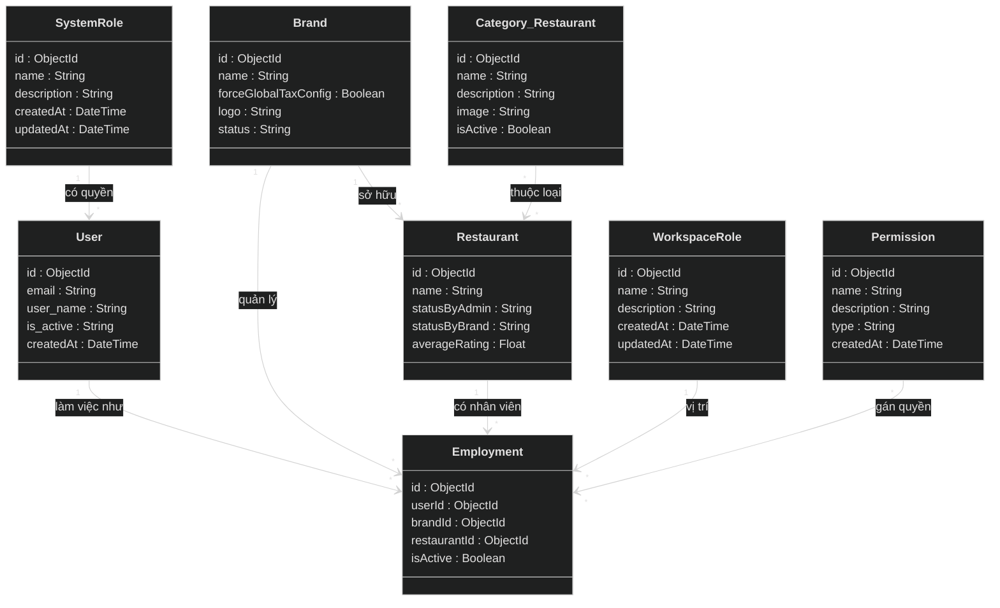
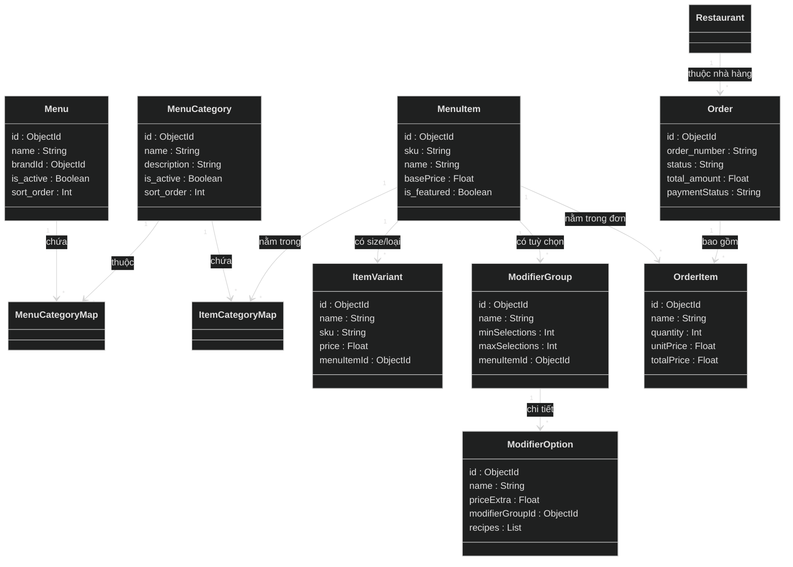
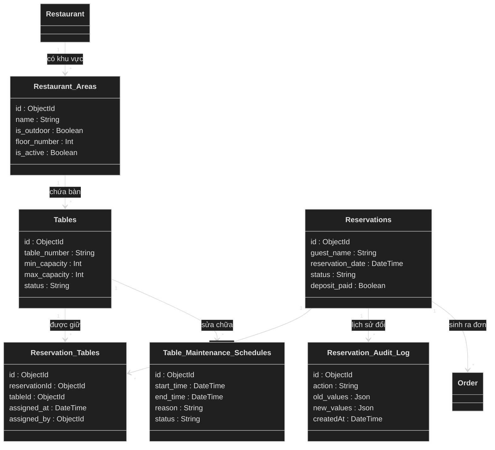
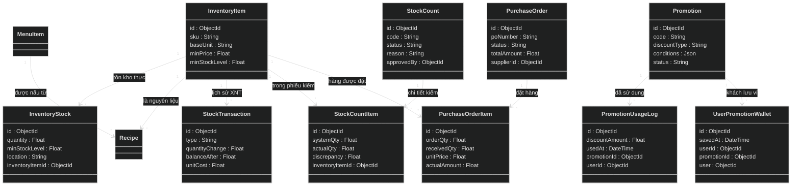
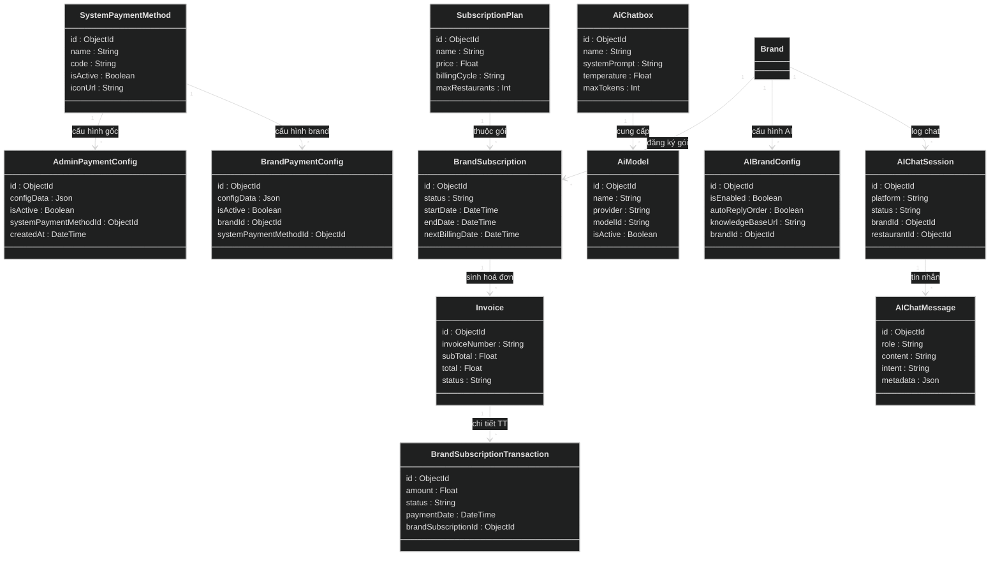

# Hệ Thống Quản Lý Nhà Hàng Đa Điểm (Multi-tenant F&B SaaS)

Chào mừng bạn đến với dự án Quản lý Nhà hàng Đa điểm (Multi-tenant F&B SaaS). Đây là một hệ thống đồ sộ bao phủ mọi nghiệp vụ từ quản lý chuỗi thương hiệu, chi nhánh, nhân sự, kiểm kho, cho đến thanh toán và tích hợp trợ lý ảo AI.

---

## 🗺️ Bản Đồ Kiến Trúc Cơ Sở Dữ Liệu (Database Schema 3D-View)

> Do quy mô của hệ thống cực kỳ đồ sộ (hơn 70 bảng cơ sở dữ liệu và 2200 dòng schema), sơ đồ đã được chia nhỏ thành 5 phân hệ (Domains) để GitHub có thể hiển thị mượt mà. 
> **Lưu ý:** Giao diện đã được chuyển sang chế độ Dark Mode (Màu Đen) và sử dụng định dạng danh sách thuộc tính chuẩn để dễ đọc hơn. Mọi bảng đều hiển thị tối thiểu 5 thuộc tính quan trọng nhất!

### 1. Phân Hệ Lõi (Core Domain: Brand, Restaurant, HR)
Đây là trái tim của hệ thống Multi-tenant, xử lý logic chuỗi thương hiệu, chi nhánh và nhân sự.

### 2. Phân Hệ Thực Đơn & Gọi Món (Menu & Order Domain)
Hệ thống xử lý cấu trúc Menu phân tầng phức tạp (Menu > Category > Item > Variant/Modifier).

### 3. Phân Hệ Đặt Bàn & Khu Vực (Reservation & Table Domain)
Quản lý sơ đồ bàn 2D/3D (tọa độ X, Y), đặt bàn trước và lịch bảo trì bàn.

### 4. Phân Hệ Kho Bãi & Khuyến Mãi (Inventory & Promotion Domain)
Theo dõi công thức nấu ăn (Recipe), kiểm kho (StockCount) và quản lý chiến dịch khuyến mãi phức tạp.

### 5. Phân Hệ Thanh Toán, AI & Thuê Bao (Billing & AI Domain)
Hệ thống thanh toán đa luồng (Subscription của Brand, Payment của Khách) và trợ lý AI Chatbot.

---

## 🕵️‍♂️ ĐÁNH GIÁ KIẾN TRÚC TỔNG THỂ (SENIOR PRO MAX LEADER MODE)

Với tư cách là một Tech Lead/Architect khó tính (áp dụng chuẩn V5.2), tôi đã audit toàn bộ cấu trúc 70 bảng Database của dự án này. Đây là một hệ thống có tham vọng lớn, bao trùm hầu hết mọi ngóc ngách của một nền tảng F&B SaaS đa khách hàng (Multi-tenant).

**🏆 Điểm đánh giá tổng quan: 7.8 / 10**

### ✅ ĐIỂM SÁNG TRONG THIẾT KẾ (The Good)
1. **Kiến trúc Multi-tenant Tốt:** Việc tách biệt `Brand` và `Restaurant` rất rạch ròi. Việc đẩy cấu hình Thuế/Phí (`isVatInclusive`, `defaultVatRate`) lên cả 2 cấp cho phép sự linh hoạt tuyệt vời cho các chuỗi nhượng quyền.
2. **Hệ thống AI Chatbot Tiên tiến:** Việc lưu trữ Intent, Metadata trong `AIChatMessage` và hỗ trợ RAG (`knowledgeBaseUrl` trong `AIBrandConfig`) cho thấy tư duy bắt kịp thời đại, sẵn sàng cho các luồng Agentic AI.
3. **Quản lý Bàn Nâng Cao (Advanced Table Management):** Lưu trữ cả tọa độ (`pos_x`, `pos_y`, `width`, `height`, `rotation`) và `shape` của bàn trực tiếp trong DB. Rất ít dự án F&B mã nguồn mở làm được tính năng sơ đồ bàn 2D trực quan thế này.
4. **Hệ sinh thái Khuyến mãi (Promotion Engine):** Bảng `Promotion` bao gồm các trường linh hoạt (Tiers, Days of Week, Time, Budget) kết hợp với JSON `conditions` cho phép tạo ra các rule giảm giá vô cùng phức tạp (giống các app giao đồ ăn lớn).
5. **Audit Trail Đầy Đủ:** Bảng `Reservation_Audit_Log`, `StockTransaction`, `LoyaltyTransaction` lưu trữ `old_values`, `new_values` và `balanceAfter` là chuẩn mực của hệ thống tài chính/kho bãi để truy vết gian lận.

### 🛑 CÁC LỖ HỔNG & TECH DEBT CHẾT NGƯỜI (The Bad & The Ugly)
Để dự án này có thể scale lên hàng ngàn nhà hàng và không bị "sập" ở môi trường Production thực tế, hệ thống đang vướng phải những thiết kế sai lầm cực kỳ nghiêm trọng cần khắc phục:

1. **Rủi ro Dữ liệu Phình To (DB Bloating) Không Kiểm Soát:**
   - Các bảng log như `AIChatMessage`, `SystemWebhookLog`, `BrandNotification` đang **thiếu TTL (Time-To-Live) Indexes**. Nếu một nhà hàng có 1000 khách chat AI mỗi ngày, sau 1 năm database MongoDB sẽ phình lên hàng chục GB rác. 
   - *Cách fix:* Phải cấu hình TTL index ở MongoDB để tự động xóa log cũ sau 30-90 ngày.

2. **Quá Tải Bảng "Employment" (God Table Anti-pattern):**
   - Bảng `Employment` hiện đang gánh quá nhiều trách nhiệm: Vừa map User với Brand, vừa map User với Restaurant, lại vừa map với Role và Permission. Việc dùng chung 1 bảng cho cả cấp độ Tập đoàn (Brand) và Chi nhánh (Restaurant) sẽ khiến câu query kiểm tra quyền (Authorization) trở nên cực kỳ chậm và phức tạp.
   - *Cách fix:* Nên tách biệt `Brand_Employment` và `Restaurant_Employment`.

3. **Cạm Bẫy Giao Dịch Kho (Inventory Concurrency Trap):**
   - Bảng `StockTransaction` và `InventoryStock` có nguy cơ bị **Race Condition** cực cao. Trong môi trường Node.js (Bất đồng bộ), nếu 2 nhân viên cùng xuất kho 1 mặt hàng cùng lúc, số lượng `quantity` và `balanceAfter` sẽ bị ghi đè sai bét nếu không sử dụng **Transaction (ACID)**.
   - *Lưu ý tử huyệt:* Vì dùng MongoDB, Prisma chỉ hỗ trợ Transaction thực thụ nếu MongoDB được cài đặt dưới dạng **Replica Set**. Nếu bạn chạy MongoDB Standalone trên localhost hoặc server rẻ tiền, toàn bộ logic trừ kho/thanh toán sẽ vỡ vụn khi có tải cao.

4. **Thiếu Compound Indexes Ở Mức Độ Trầm Trọng:**
   - Ở các bảng lớn như `Order`, `OrderItem`, `StockTransaction`, khai báo Index hiện tại là quá ngây thơ. 
   - Ví dụ: `@@index([restaurantId, status, createdAt])` trên `Order` là tốt, nhưng lại thiếu Index cho các tác vụ phân tích doanh thu (Group by Day, By MenuItem). Khi Admin kéo báo cáo doanh thu tháng, database sẽ phải Full-scan toàn bộ bảng OrderItem, gây chết Server.

5. **Thiếu Isolation (Cô lập) Dữ liệu Nhạy Cảm:**
   - Bảng `ApiKey` lưu trữ `encryptedKey` chung với các thông tin truy vấn. Mặc dù đã mã hóa, nhưng việc thiết kế chung thế này rất rủi ro. 
   - Mã hóa Token Webhook (`webhookTokenHash`) ở `RestaurantPaymentConfig` nhưng không có cơ chế Key Rotation rõ ràng.

### 🎯 TỔNG KẾT
Đây là một dự án có nghiệp vụ (Business Logic) **rất xuất sắc và chi tiết**. Bạn đã nghĩ đến những thứ mà một hệ thống F&B thực tế cần (Audit log, Pos_X/Y của bàn, Rule khuyến mãi). Tuy nhiên, về mặt hạ tầng Database (Database Infrastructure), nó vẫn mang hơi hướng "code để chạy được" thay vì "code để scale". Cần đặc biệt chú ý đến Replica Set của MongoDB và đánh Index lại toàn bộ các trường phục vụ Báo cáo (Reporting) trước khi Go-live.
