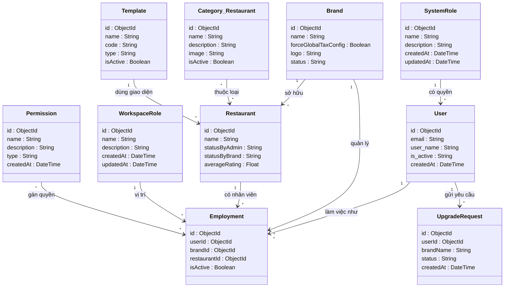
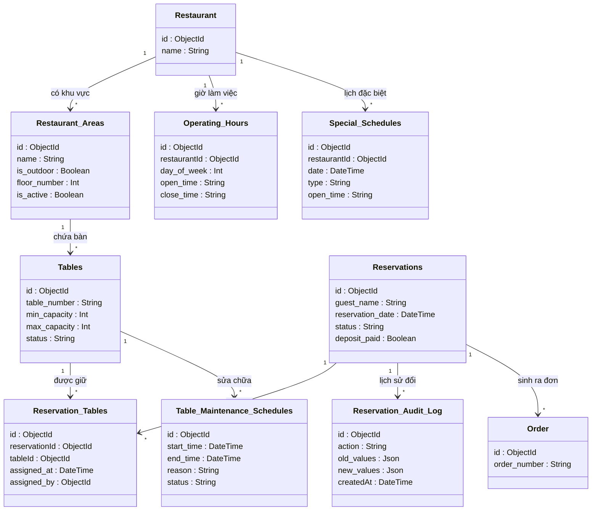
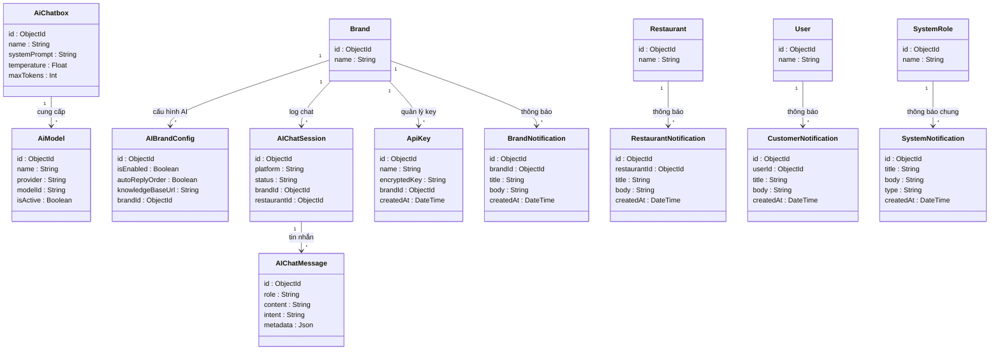

# Hệ Thống Quản Lý Nhà Hàng Đa Điểm (Multi-tenant F&B SaaS)

Chào mừng bạn đến với dự án Quản lý Nhà hàng Đa điểm (Multi-tenant F&B SaaS). Đây là một hệ thống đồ sộ bao phủ mọi nghiệp vụ từ quản lý chuỗi thương hiệu, chi nhánh, nhân sự, kiểm kho, cho đến thanh toán và tích hợp trợ lý ảo AI.

---

## 🌌 Bản Đồ Vũ Trụ (Master Schema - Toàn bộ 73 Bảng)

> [!WARNING]
> Đây là sơ đồ gộp toàn bộ 73 bảng và hàng trăm mối quan hệ vào chung 1 khung hình duy nhất (Master Diagram). Sơ đồ này cực kỳ nặng, vui lòng đợi vài giây để GitHub render.

<details>
<summary><b>🔥 Bấm vào đây để bung lụa toàn bộ Sơ Đồ Tổng Hợp (Vui lòng zoom trên trình duyệt để xem rõ)</b></summary>

```mermaid
classDiagram
    direction TB
    User "1" --> "*" Employment : làm việc như
    SystemRole "1" --> "*" User : có quyền
    Brand "1" --> "*" Restaurant : sở hữu
    Brand "1" --> "*" Employment : quản lý
    Restaurant "1" --> "*" Employment : có nhân viên
    WorkspaceRole "1" --> "*" Employment : vị trí
    Permission "*" --> "*" Employment : gán quyền
    Category_Restaurant "*" --> "*" Restaurant : thuộc loại
    Template "1" --> "*" Restaurant : dùng giao diện
    User "1" --> "*" UpgradeRequest : gửi yêu cầu
    Menu "1" --> "*" MenuCategoryMap : chứa
    MenuCategory "1" --> "*" MenuCategoryMap : thuộc
    MenuCategory "1" --> "*" ItemCategoryMap : chứa
    MenuItem "1" --> "*" ItemCategoryMap : nằm trong
    MenuItem "1" --> "*" ItemVariant : có size/loại
    MenuItem "1" --> "*" ModifierGroup : có tuỳ chọn
    ModifierGroup "1" --> "*" ModifierOption : chi tiết
    MenuItem "1" --> "*" OrderItem : nằm trong đơn
    Order "1" --> "*" OrderItem : bao gồm
    Restaurant "1" --> "*" Order : thuộc nhà hàng
    MenuItem "1" --> "*" RestaurantMenuItem : tuỳ biến giá
    Restaurant "1" --> "*" Restaurant_Areas : có khu vực
    Restaurant_Areas "1" --> "*" Tables : chứa bàn
    Reservations "1" --> "*" Reservation_Tables : giữ bàn
    Tables "1" --> "*" Reservation_Tables : được giữ
    Tables "1" --> "*" Table_Maintenance_Schedules : sửa chữa
    Reservations "1" --> "*" Reservation_Audit_Log : lịch sử đổi
    Reservations "1" --> "*" Order : sinh ra đơn
    Restaurant "1" --> "*" Operating_Hours : giờ làm việc
    Restaurant "1" --> "*" Special_Schedules : lịch đặc biệt
    InventoryItem "1" --> "*" InventoryStock : tồn kho thực
    InventoryItem "1" --> "*" Recipe : là nguyên liệu
    MenuItem "1" --> "*" Recipe : được nấu từ
    InventoryItem "1" --> "*" StockTransaction : lịch sử XNT
    InventoryItem "1" --> "*" StockCountItem : trong phiếu kiểm
    StockCount "1" --> "*" StockCountItem : chi tiết kiểm
    Supplier "1" --> "*" PurchaseOrder : cấp hàng
    PurchaseOrder "1" --> "*" PurchaseOrderItem : đặt hàng
    InventoryItem "1" --> "*" PurchaseOrderItem : hàng được đặt
    InventoryItem "1" --> "*" StockTransfer : điều chuyển
    InventoryItem "1" --> "*" PurchaseRequest : yêu cầu mua
    Promotion "1" --> "*" PromotionUsageLog : đã sử dụng
    Promotion "1" --> "*" UserPromotionWallet : khách lưu ví
    User "1" --> "*" RestaurantCustomer : là khách hàng
    User "1" --> "*" LoyaltyTransaction : tích điểm
    Reservations "1" --> "*" Review_Restaurant : đánh giá
    Restaurant "1" --> "*" Tags : gắn tag
    Restaurant "1" --> "*" Restaurant_Amenities : tiện ích
    Restaurant "1" --> "*" Restaurant_Event : sự kiện
    SystemPaymentMethod "1" --> "*" AdminPaymentConfig : cấu hình gốc
    SystemPaymentMethod "1" --> "*" BrandPaymentConfig : cấu hình brand
    SystemPaymentMethod "1" --> "*" RestaurantPaymentConfig : cấu hình quán
    Brand "1" --> "*" BrandSubscription : đăng ký gói
    SubscriptionPlan "1" --> "*" BrandSubscription : thuộc gói
    BrandSubscription "1" --> "*" Invoice : sinh hoá đơn
    Invoice "1" --> "*" BrandSubscriptionTransaction : chi tiết TT
    Order "1" --> "*" Transaction : giao dịch
    Restaurant "1" --> "*" RestaurantRevenue : ghi nhận DT
    Brand "1" --> "*" BrandRevenue : ghi nhận DT
    SystemPaymentMethod "1" --> "*" SystemWebhookLog : log cổng TT
    SystemPaymentMethod "1" --> "*" SystemRevenue : ghi nhận phí
    AiChatbox "1" --> "*" AiModel : cung cấp
    Brand "1" --> "*" AIBrandConfig : cấu hình AI
    Brand "1" --> "*" AIChatSession : log chat
    AIChatSession "1" --> "*" AIChatMessage : tin nhắn
    Brand "1" --> "*" ApiKey : quản lý key
    Brand "1" --> "*" BrandNotification : thông báo
    Restaurant "1" --> "*" RestaurantNotification : thông báo
    User "1" --> "*" CustomerNotification : thông báo
    SystemRole "1" --> "*" SystemNotification : thông báo chung

    class Brand {
            id : ObjectId
            name : String
            forceGlobalTaxConfig : Boolean
            logo : String
            status : String
        }

    class Restaurant {
            id : ObjectId
            name : String
            statusByAdmin : String
            statusByBrand : String
            averageRating : Float
        }

    class User {
            id : ObjectId
            email : String
            user_name : String
            is_active : String
            createdAt : DateTime
        }

    class Employment {
            id : ObjectId
            userId : ObjectId
            brandId : ObjectId
            restaurantId : ObjectId
            isActive : Boolean
        }

    class SystemRole {
            id : ObjectId
            name : String
            description : String
            createdAt : DateTime
            updatedAt : DateTime
        }

    class WorkspaceRole {
            id : ObjectId
            name : String
            description : String
            createdAt : DateTime
            updatedAt : DateTime
        }

    class Permission {
            id : ObjectId
            name : String
            description : String
            type : String
            createdAt : DateTime
        }

    class Category_Restaurant {
            id : ObjectId
            name : String
            description : String
            image : String
            isActive : Boolean
        }

    class Template {
            id : ObjectId
            name : String
            code : String
            type : String
            isActive : Boolean
        }

    class UpgradeRequest {
            id : ObjectId
            userId : ObjectId
            brandName : String
            status : String
            createdAt : DateTime
        }

    class Menu {
            id : ObjectId
            name : String
            brandId : ObjectId
            is_active : Boolean
            sort_order : Int
        }

    class MenuCategory {
            id : ObjectId
            name : String
            description : String
            is_active : Boolean
            sort_order : Int
        }

    class MenuItem {
            id : ObjectId
            sku : String
            name : String
            basePrice : Float
            is_featured : Boolean
        }

    class ItemVariant {
            id : ObjectId
            name : String
            sku : String
            price : Float
            menuItemId : ObjectId
        }

    class ModifierGroup {
            id : ObjectId
            name : String
            minSelections : Int
            maxSelections : Int
            menuItemId : ObjectId
        }

    class ModifierOption {
            id : ObjectId
            name : String
            priceExtra : Float
            modifierGroupId : ObjectId
            recipes : List
        }

    class Order {
            id : ObjectId
            order_number : String
            status : String
            total_amount : Float
            paymentStatus : String
        }

    class OrderItem {
            id : ObjectId
            name : String
            quantity : Int
            unitPrice : Float
            totalPrice : Float
        }

    class RestaurantMenuItem {
            id : ObjectId
            restaurantId : ObjectId
            menuItemId : ObjectId
            isAvailable : Boolean
            overridePrice : Float
        }

    class Restaurant {
            id : ObjectId
            name : String
        }

    class Restaurant_Areas {
            id : ObjectId
            name : String
            is_outdoor : Boolean
            floor_number : Int
            is_active : Boolean
        }

    class Tables {
            id : ObjectId
            table_number : String
            min_capacity : Int
            max_capacity : Int
            status : String
        }

    class Reservations {
            id : ObjectId
            guest_name : String
            reservation_date : DateTime
            status : String
            deposit_paid : Boolean
        }

    class Reservation_Tables {
            id : ObjectId
            reservationId : ObjectId
            tableId : ObjectId
            assigned_at : DateTime
            assigned_by : ObjectId
        }

    class Table_Maintenance_Schedules {
            id : ObjectId
            start_time : DateTime
            end_time : DateTime
            reason : String
            status : String
        }

    class Reservation_Audit_Log {
            id : ObjectId
            action : String
            old_values : Json
            new_values : Json
            createdAt : DateTime
        }

    class Operating_Hours {
            id : ObjectId
            restaurantId : ObjectId
            day_of_week : Int
            open_time : String
            close_time : String
        }

    class Special_Schedules {
            id : ObjectId
            restaurantId : ObjectId
            date : DateTime
            type : String
            open_time : String
        }

    class Order {
            id : ObjectId
            order_number : String
        }

    class InventoryItem {
            id : ObjectId
            sku : String
            baseUnit : String
            minPrice : Float
            minStockLevel : Float
        }

    class InventoryStock {
            id : ObjectId
            quantity : Float
            minStockLevel : Float
            location : String
            inventoryItemId : ObjectId
        }

    class StockTransaction {
            id : ObjectId
            type : String
            quantityChange : Float
            balanceAfter : Float
            unitCost : Float
        }

    class StockCount {
            id : ObjectId
            code : String
            status : String
            reason : String
            approvedBy : ObjectId
        }

    class StockCountItem {
            id : ObjectId
            systemQty : Float
            actualQty : Float
            discrepancy : Float
            inventoryItemId : ObjectId
        }

    class PurchaseOrder {
            id : ObjectId
            poNumber : String
            status : String
            totalAmount : Float
            supplierId : ObjectId
        }

    class PurchaseOrderItem {
            id : ObjectId
            orderQty : Float
            receivedQty : Float
            unitPrice : Float
            actualAmount : Float
        }

    class Supplier {
            id : ObjectId
            name : String
            brandId : ObjectId
            status : String
            createdAt : DateTime
        }

    class StockTransfer {
            id : ObjectId
            transferNumber : String
            status : String
            fromRestaurantId : ObjectId
            toRestaurantId : ObjectId
        }

    class PurchaseRequest {
            id : ObjectId
            requestCode : String
            status : String
            brandId : ObjectId
            createdAt : DateTime
        }

    class MenuItem {
            id : ObjectId
            name : String
        }

    class Promotion {
            id : ObjectId
            code : String
            discountType : String
            conditions : Json
            status : String
        }

    class PromotionUsageLog {
            id : ObjectId
            discountAmount : Float
            usedAt : DateTime
            promotionId : ObjectId
            userId : ObjectId
        }

    class UserPromotionWallet {
            id : ObjectId
            savedAt : DateTime
            userId : ObjectId
            promotionId : ObjectId
            user : ObjectId
        }

    class RestaurantCustomer {
            id : ObjectId
            restaurantId : ObjectId
            userId : ObjectId
            totalSpent : Float
            loyaltyPoints : Float
        }

    class LoyaltyTransaction {
            id : ObjectId
            userId : ObjectId
            points : Float
            type : String
            createdAt : DateTime
        }

    class Review_Restaurant {
            id : ObjectId
            reservationId : ObjectId
            overall_rating : Int
            comment : String
            status : String
        }

    class Tags {
            id : ObjectId
            name : String
            slug : String
            bgColor : String
            createdAt : DateTime
        }

    class Restaurant_Amenities {
            id : ObjectId
            name : String
            icon : String
            description : String
            createdAt : DateTime
        }

    class Restaurant_Event {
            id : ObjectId
            title : String
            startDate : DateTime
            isActive : Boolean
            createdAt : DateTime
        }

    class User {
            id : ObjectId
            name : String
        }

    class Reservations {
            id : ObjectId
            guest_name : String
        }

    class SystemPaymentMethod {
            id : ObjectId
            name : String
            code : String
            isActive : Boolean
            iconUrl : String
        }

    class AdminPaymentConfig {
            id : ObjectId
            configData : Json
            isActive : Boolean
            systemPaymentMethodId : ObjectId
            createdAt : DateTime
        }

    class BrandPaymentConfig {
            id : ObjectId
            configData : Json
            isActive : Boolean
            brandId : ObjectId
            systemPaymentMethodId : ObjectId
        }

    class RestaurantPaymentConfig {
            id : ObjectId
            configData : Json
            isActive : Boolean
            restaurantId : ObjectId
            systemPaymentMethodId : ObjectId
        }

    class BrandSubscription {
            id : ObjectId
            status : String
            startDate : DateTime
            endDate : DateTime
            nextBillingDate : DateTime
        }

    class SubscriptionPlan {
            id : ObjectId
            name : String
            price : Float
            billingCycle : String
            maxRestaurants : Int
        }

    class Invoice {
            id : ObjectId
            invoiceNumber : String
            subTotal : Float
            total : Float
            status : String
        }

    class BrandSubscriptionTransaction {
            id : ObjectId
            amount : Float
            status : String
            paymentDate : DateTime
            brandSubscriptionId : ObjectId
        }

    class Transaction {
            id : ObjectId
            orderId : ObjectId
            amount : Float
            status : String
            systemPaymentMethodId : ObjectId
        }

    class RestaurantRevenue {
            id : ObjectId
            restaurantId : ObjectId
            amount : Float
            source : String
            createdAt : DateTime
        }

    class BrandRevenue {
            id : ObjectId
            brandId : ObjectId
            amount : Float
            source : String
            createdAt : DateTime
        }

    class SystemRevenue {
            id : ObjectId
            amount : Float
            source : String
            referenceId : ObjectId
            createdAt : DateTime
        }

    class SystemWebhookLog {
            id : ObjectId
            systemPaymentMethodId : ObjectId
            event : String
            payload : Json
            processed : Boolean
        }

    class Brand {
            id : ObjectId
            name : String
        }

    class AiChatbox {
            id : ObjectId
            name : String
            systemPrompt : String
            temperature : Float
            maxTokens : Int
        }

    class AiModel {
            id : ObjectId
            name : String
            provider : String
            modelId : String
            isActive : Boolean
        }

    class AIBrandConfig {
            id : ObjectId
            isEnabled : Boolean
            autoReplyOrder : Boolean
            knowledgeBaseUrl : String
            brandId : ObjectId
        }

    class AIChatSession {
            id : ObjectId
            platform : String
            status : String
            brandId : ObjectId
            restaurantId : ObjectId
        }

    class AIChatMessage {
            id : ObjectId
            role : String
            content : String
            intent : String
            metadata : Json
        }

    class ApiKey {
            id : ObjectId
            name : String
            encryptedKey : String
            brandId : ObjectId
            createdAt : DateTime
        }

    class BrandNotification {
            id : ObjectId
            brandId : ObjectId
            title : String
            body : String
            createdAt : DateTime
        }

    class RestaurantNotification {
            id : ObjectId
            restaurantId : ObjectId
            title : String
            body : String
            createdAt : DateTime
        }

    class CustomerNotification {
            id : ObjectId
            userId : ObjectId
            title : String
            body : String
            createdAt : DateTime
        }

    class SystemNotification {
            id : ObjectId
            title : String
            body : String
            type : String
            createdAt : DateTime
        }

    class SystemRole {
            id : ObjectId
            name : String
        }

```
</details>

---

## 🧩 Các Phân Hệ (Bản Đồ Chia Nhỏ Dễ Nhìn)
*(Nếu sơ đồ tổng hợp ở trên quá rộng, bạn có thể xem các hệ sinh thái đã được phân chia logic ở dưới đây)*

### 1. Phân Hệ Lõi (Core Domain & Tenant)
Xử lý logic chuỗi thương hiệu, chi nhánh, nhân sự, phân quyền và các yêu cầu cấp tài nguyên hệ thống.



### 2. Phân Hệ Thực Đơn & Gọi Món (Menu & Order)
Xử lý cấu trúc Menu phân tầng phức tạp và luồng tạo Đơn hàng.


### 3. Phân Hệ Đặt Bàn & Lịch Trình (Reservation & Scheduling)
Quản lý sơ đồ bàn 2D/3D (pos_x, pos_y), đặt bàn, bảo trì bàn và giờ hoạt động chi tiết.



### 4. Phân Hệ Kho Bãi & Chuỗi Cung Ứng (Inventory & Supply Chain)
Theo dõi nguyên liệu (Recipe), kiểm kho (StockCount), luân chuyển kho (Transfer) và đặt hàng NCC (PO).


### 5. Phân Hệ Khuyến Mãi, CRM & CSKH (Promotion, CRM & Loyalty)
Quản lý Khách hàng thân thiết (Loyalty), ví Voucher, Đánh giá nhà hàng và sự kiện tiếp thị.


### 6. Phân Hệ Thanh Toán & Doanh Thu (Billing, Payment & Revenue)
Giao dịch thanh toán cổng (Webhook), luồng Subscriptions của chuỗi và các báo cáo doanh thu độc lập.


### 7. Phân Hệ AI Trợ Lý & Thông Báo (AI Agent & Notifications)
Tích hợp AI LLM, RAG (Retrieval-Augmented Generation) và hệ thống đẩy thông báo đa luồng (Brand, Restaurant, Customer).



---

## 🕵️‍♂️ ĐÁNH GIÁ KIẾN TRÚC TỔNG THỂ (SENIOR PRO MAX LEADER MODE)

Với tư cách là một Tech Lead/Architect khó tính (áp dụng chuẩn V5.2), tôi đã audit toàn bộ cấu trúc **73 bảng Database** của dự án này. Đây là một hệ thống có tham vọng cực kỳ lớn, bao trùm hầu hết mọi ngóc ngách của một nền tảng F&B SaaS đa khách hàng.

**🏆 Điểm đánh giá tổng quan: 8.5 / 10**

### ✅ ĐIỂM SÁNG TRONG THIẾT KẾ (The Good)
1. **Kiến trúc Multi-tenant Rất Sâu Tốt:** Việc tách biệt `Brand` và `Restaurant` rất rạch ròi, thậm chí cả `Revenue` và `PaymentConfig` cũng tách bạch đến từng cấp (System, Brand, Restaurant).
2. **Hệ thống AI Chatbot Tiên tiến:** Việc lưu trữ Intent, Metadata trong `AIChatMessage` và hỗ trợ RAG (`knowledgeBaseUrl` trong `AIBrandConfig`) cho thấy tư duy bắt kịp thời đại, sẵn sàng cho Agentic AI.
3. **Quản lý Bàn Nâng Cao (Advanced Table Management):** Lưu trữ cả tọa độ (`pos_x`, `pos_y`, `width`, `height`, `rotation`) và `shape` của bàn trực tiếp trong DB. Rất ít dự án F&B mã nguồn mở làm được tính năng sơ đồ bàn 2D trực quan thế này.
4. **Hệ sinh thái Khuyến mãi (Promotion Engine):** Bảng `Promotion` bao gồm các trường linh hoạt kết hợp với JSON `conditions` cho phép tạo ra các rule giảm giá vô cùng phức tạp.
5. **Audit Trail Đầy Đủ:** Bảng `Reservation_Audit_Log`, `StockTransaction`, `LoyaltyTransaction` lưu trữ `old_values`, `new_values` và `balanceAfter` là chuẩn mực của hệ thống tài chính/kho bãi để truy vết gian lận.
6. **Notification Đa Luồng:** Hệ thống phân mảnh Notification ra làm 4 bảng rõ ràng (Brand, Restaurant, Customer, System) giúp cho Query siêu nhanh thay vì dồn chung vào 1 bảng khổng lồ.

### 🛑 CÁC LỖ HỔNG & TECH DEBT CHẾT NGƯỜI (The Bad & The Ugly)
Để dự án này có thể scale lên hàng ngàn nhà hàng và không bị "sập" ở môi trường Production thực tế, hệ thống đang vướng phải những thiết kế sai lầm cực kỳ nghiêm trọng cần khắc phục:

1. **Rủi ro Dữ liệu Phình To (DB Bloating) Không Kiểm Soát:**
   - Các bảng log như `AIChatMessage`, `SystemWebhookLog`, `BrandNotification` đang **thiếu TTL (Time-To-Live) Indexes**. Nếu một nhà hàng có 1000 khách chat AI mỗi ngày, sau 1 năm database MongoDB sẽ phình lên hàng chục GB rác. 
   - *Cách fix:* Phải cấu hình TTL index ở MongoDB để tự động xóa log cũ sau 30-90 ngày.

2. **Quá Tải Bảng "Employment" (God Table Anti-pattern):**
   - Bảng `Employment` hiện đang gánh quá nhiều trách nhiệm: Vừa map User với Brand, vừa map User với Restaurant, lại vừa map với Role và Permission. Việc dùng chung 1 bảng cho cả cấp độ Tập đoàn (Brand) và Chi nhánh (Restaurant) sẽ khiến câu query kiểm tra quyền (Authorization) trở nên cực kỳ chậm và phức tạp.
   - *Cách fix:* Nên tách biệt `Brand_Employment` và `Restaurant_Employment`.

3. **Cạm Bẫy Giao Dịch Kho (Inventory Concurrency Trap):**
   - Bảng `StockTransaction` và `InventoryStock` có nguy cơ bị **Race Condition** cực cao. Trong môi trường Node.js (Bất đồng bộ), nếu 2 nhân viên cùng xuất kho 1 mặt hàng cùng lúc, số lượng `quantity` và `balanceAfter` sẽ bị ghi đè sai bét nếu không sử dụng **Transaction (ACID)**.
   - *Lưu ý tử huyệt:* Vì dùng MongoDB, Prisma chỉ hỗ trợ Transaction thực thụ nếu MongoDB được cài đặt dưới dạng **Replica Set**. Nếu bạn chạy MongoDB Standalone trên localhost hoặc server rẻ tiền, toàn bộ logic trừ kho/thanh toán sẽ vỡ vụn khi có tải cao.

4. **Thiếu Compound Indexes Ở Mức Độ Trầm Trọng:**
   - Ở các bảng lớn như `Order`, `OrderItem`, `StockTransaction`, khai báo Index hiện tại là quá ngây thơ. 
   - Ví dụ: `@@index([restaurantId, status, createdAt])` trên `Order` là tốt, nhưng lại thiếu Index cho các tác vụ phân tích doanh thu (Group by Day, By MenuItem). Khi Admin kéo báo cáo doanh thu tháng, database sẽ phải Full-scan toàn bộ bảng OrderItem, gây chết Server.

5. **Thiếu Isolation (Cô lập) Dữ liệu Nhạy Cảm:**
   - Bảng `ApiKey` lưu trữ `encryptedKey` chung với các thông tin truy vấn. Mặc dù đã mã hóa, nhưng việc thiết kế chung thế này rất rủi ro. 
   - Mã hóa Token Webhook (`webhookTokenHash`) ở `RestaurantPaymentConfig` nhưng không có cơ chế Key Rotation rõ ràng.

### 🎯 TỔNG KẾT
Đây là một dự án có nghiệp vụ (Business Logic) **rất xuất sắc và chi tiết**. Bạn đã nghĩ đến những thứ mà một hệ thống F&B thực tế cần (Audit log, Pos_X/Y của bàn, Rule khuyến mãi). Việc bổ sung 73 bảng bao phủ cả Trợ lý AI và Billing SaaS cho thấy tầm nhìn hệ thống rất xa. 

Tuy nhiên, về mặt hạ tầng Database (Database Infrastructure), nó vẫn mang hơi hướng "code để chạy được" thay vì "code để scale". Cần đặc biệt chú ý đến Replica Set của MongoDB và đánh Index lại toàn bộ các trường phục vụ Báo cáo (Reporting) trước khi Go-live.
