# Sơ Đồ Cấu Trúc Database (ER Diagram)

Dưới đây là sơ đồ thực thể kết nối (ER Diagram) thể hiện các quan hệ chính giữa các Models dựa trên schema Prisma hiện tại của dự án.

> [!TIP]
> Sơ đồ được gom nhóm các thành phần chính lại để bạn dễ nhìn bức tranh tổng thể.

```mermaid
erDiagram
    %% KHỐI TỔ CHỨC & QUẢN LÝ
    BRAND {
        String id PK
        String name
        Boolean isActive
    }
    RESTAURANT {
        String id PK
        String name
        String brandId FK
        Float averageRating
    }
    CATEGORY_RESTAURANT {
        String id PK
        String name
    }
    UPGRADE_REQUEST {
        String id PK
        String userId FK
        String brandName
        String status
    }
    
    %% KHỐI NGƯỜI DÙNG & PHÂN QUYỀN
    USER {
        String id PK
        String user_name
        String email
        String roleId FK
    }
    ROLE {
        String id PK
        String name
    }
    EMPLOYMENT {
        String id PK
        String userId FK
        String brandId FK
        String restaurantId FK
    }
    PERMISSION {
        String id PK
        String name
    }
    PERMISSION_VS_EMPLOYMENT {
        String id PK
        String permissionId FK
        String employmentId FK
    }

    %% KHỐI SẢN PHẨM & THỰC ĐƠN
    MENU {
        String id PK
        String name
        String restaurantId FK
        String brandId FK
    }
    MENU_CATEGORY {
        String id PK
        String menuId FK
        String name
    }
    MENU_ITEM {
        String id PK
        String name
        Float base_price
        String categoryId FK
        String restaurantId FK
        String brandId FK
    }

    %% KHỐI VẬN HÀNH & BÀN
    RESTAURANT_AREAS {
        String id PK
        String name
        String restaurantId FK
    }
    TABLES {
        String id PK
        String table_number
        String areaId FK
        String restaurantId FK
    }
    OPERATING_HOURS {
        String id PK
        String restaurantId FK
        Int day_of_week
    }
    SPECIAL_SCHEDULES {
        String id PK
        String restaurantId FK
        String type
    }

    %% KHỐI ĐẶT BÀN & ĐƠN HÀNG
    RESERVATIONS {
        String id PK
        String restaurantId FK
        String userId FK
        DateTime reservation_date
        String status
    }
    RESERVATION_TABLES {
        String id PK
        String reservationId FK
        String tableId FK
    }
    RESERVATION_AUDIT_LOG {
        String id PK
        String reservationId FK
        String action
    }
    ORDER {
        String id PK
        String reservationId FK
        String tableId FK
        Float total_amount
        String status
    }
    ORDER_ITEM {
        String id PK
        String orderId FK
        String menuItemId FK
        Int quantity
        String status
    }
    TRANSACTION {
        String id PK
        String orderId FK
        String systemPaymentMethodId FK
        Float amount
        String status
    }

    %% KHỐI TÀI CHÍNH & THANH TOÁN
    SYSTEM_PAYMENT_METHOD {
        String id PK
        String name
        String code
        Boolean isActive
    }
    BRAND_PAYMENT_CONFIG {
        String id PK
        String brandId FK
        String systemPaymentMethodId FK
    }
    RESTAURANT_PAYMENT_CONFIG {
        String id PK
        String restaurantId FK
        String systemPaymentMethodId FK
    }
    SYSTEM_REVENUE {
        String id PK
        Float amount
        String source
    }
    BRAND_REVENUE {
        String id PK
        String brandId FK
        Float amount
        String source
    }
    RESTAURANT_REVENUE {
        String id PK
        String restaurantId FK
        Float amount
        String source
    }
    SUBSCRIPTION_PLAN {
        String id PK
        String name
        Float price
    }
    BRAND_SUBSCRIPTION {
        String id PK
        String brandId FK
        String planId FK
        String status
    }
    BRAND_SUBSCRIPTION_TRANSACTION {
        String id PK
        String brandSubscriptionId FK
        Float amount
    }

    %% KHỐI KHÁCH HÀNG & MARKETING
    REVIEW_RESTAURANT {
        String id PK
        String reservationId FK
        Int overall_rating
    }
    PROMOTION {
        String id PK
        String code
        Float discount_value
    }
    NOTIFICATIONS {
        String id PK
        String type
        String recipient
    }

    %% QUAN HỆ KHỐI TỔ CHỨC
    BRAND ||--o{ RESTAURANT : "Sở hữu"
    CATEGORY_RESTAURANT }o--o{ RESTAURANT : "Danh mục"
    USER ||--o| UPGRADE_REQUEST : "Xin cấp quyền quản lý"

    %% QUAN HỆ KHỐI NHÂN SỰ
    USER }o--|| ROLE : "Vai trò"
    USER ||--o{ EMPLOYMENT : "Nhân viên"
    RESTAURANT ||--o{ EMPLOYMENT : "Gán nhân viên"
    BRAND ||--o{ EMPLOYMENT : "Gán nhân viên"
    EMPLOYMENT ||--o{ PERMISSION_VS_EMPLOYMENT : "Gán quyền"
    PERMISSION ||--o{ PERMISSION_VS_EMPLOYMENT : "Cấp quyền"

    %% QUAN HỆ KHỐI THỰC ĐƠN
    RESTAURANT ||--o{ MENU : "Có Menu"
    BRAND ||--o{ MENU : "Menu chuỗi"
    MENU ||--o{ MENU_CATEGORY : "Gồm danh mục"
    MENU_CATEGORY ||--o{ MENU_ITEM : "Gồm các món"
    RESTAURANT ||--o{ MENU_ITEM : "Món ăn"

    %% QUAN HỆ KHỐI BÀN & HOẠT ĐỘNG
    RESTAURANT ||--o{ RESTAURANT_AREAS : "Khu vực"
    RESTAURANT_AREAS ||--o{ TABLES : "Bàn"
    RESTAURANT ||--o{ TABLES : "Thuộc nhà hàng"
    RESTAURANT ||--o{ OPERATING_HOURS : "Lịch hoạt động"
    RESTAURANT ||--o{ SPECIAL_SCHEDULES : "Lịch đặc biệt"

    %% QUAN HỆ KHỐI DỊCH VỤ
    USER ||--o{ RESERVATIONS : "Đặt bàn"
    RESTAURANT ||--o{ RESERVATIONS : "Nhận đơn"
    RESERVATIONS ||--o{ RESERVATION_TABLES : "Xếp bàn"
    TABLES ||--o{ RESERVATION_TABLES : "Chứa khách"
    RESERVATIONS ||--o{ RESERVATION_AUDIT_LOG : "Ghi log"
    
    RESERVATIONS ||--o{ ORDER : "Tạo đơn hàng"
    TABLES ||--o{ ORDER : "Gắn với bàn"
    ORDER ||--o{ ORDER_ITEM : "Món ăn gọi"
    MENU_ITEM ||--o{ ORDER_ITEM : "Bán ra"
    
    ORDER ||--o{ TRANSACTION : "Thanh toán"

    %% QUAN HỆ KHỐI TÀI CHÍNH
    SYSTEM_PAYMENT_METHOD ||--o{ BRAND_PAYMENT_CONFIG : "Hỗ trợ"
    BRAND ||--o{ BRAND_PAYMENT_CONFIG : "Cấu hình thanh toán"
    SYSTEM_PAYMENT_METHOD ||--o{ RESTAURANT_PAYMENT_CONFIG : "Hỗ trợ"
    RESTAURANT ||--o{ RESTAURANT_PAYMENT_CONFIG : "Cấu hình thanh toán"
    
    SYSTEM_PAYMENT_METHOD ||--o{ TRANSACTION : "Phương thức TT"
    
    BRAND ||--o{ BRAND_REVENUE : "Doanh thu"
    RESTAURANT ||--o{ RESTAURANT_REVENUE : "Doanh thu"

    SUBSCRIPTION_PLAN ||--o{ BRAND_SUBSCRIPTION : "Gói đăng ký"
    BRAND ||--o{ BRAND_SUBSCRIPTION : "Đăng ký"
    BRAND_SUBSCRIPTION ||--o{ BRAND_SUBSCRIPTION_TRANSACTION : "Thanh toán gói"

    %% QUAN HỆ MARKETING & CSKH
    RESERVATIONS ||--o| REVIEW_RESTAURANT : "Khách đánh giá"
    USER ||--o{ REVIEW_RESTAURANT : "Đánh giá"
    RESTAURANT ||--o{ REVIEW_RESTAURANT : "Nhận đánh giá"
    USER ||--o{ NOTIFICATIONS : "Nhận thông báo"
    RESERVATIONS ||--o{ NOTIFICATIONS : "Thông báo theo đơn"
```

## Các module chính trong Database (Cập nhật):
1. **Tenant (Đa khách hàng):** Hỗ trợ mô hình chuỗi (Brand) quản lý nhiều Nhà hàng (Restaurant). Cấp phát quyền yêu cầu nâng cấp (`UpgradeRequest`).
2. **HR & RBAC (Nhân sự & Phân quyền):** Bảng User, Role, Employment, Permission. Quản lý linh hoạt quyền cho nhân viên tại 1 nhà hàng cụ thể hoặc cấp độ toàn Brand.
3. **Menu & Product:** Quản lý menu nhiều cấp (Menu > MenuCategory > MenuItem) hỗ trợ cả mức độ Brand và Restaurant riêng lẻ.
4. **Dining & Booking:** Quản lý chi tiết việc Khách đặt bàn (Reservation), Xếp bàn (Tables, Restaurant_Areas), Gọi món (Order, OrderItem) với luồng Audit đầy đủ (`Reservation_Audit_Log`).
5. **Subscription (Đăng ký trả phí):** Brand đăng ký các gói cước (`SubscriptionPlan`, `BrandSubscription`) với các giao dịch trả phí liên quan (`BrandSubscriptionTransaction`).
6. **Finance & Payment:** Hệ thống tách biệt cấu hình thanh toán gốc (`SystemPaymentMethod`) cho các mức độ Brand/Restaurant. Các bảng doanh thu (`SystemRevenue`, `BrandRevenue`, `RestaurantRevenue`) theo dõi và báo cáo dòng tiền theo từng cấp quản lý (Admin thu phí dịch vụ/gói cước, Brand quản lý doanh thu chuỗi, Restaurant thu từ Order).
7. **CRM & Marketing:** Khuyến mãi (Promotion), Đánh giá nhà hàng (Review_Restaurant), Thông báo đa kênh (Notifications).
