# Sơ Đồ Cấu Trúc Database (ER Diagram)

Dưới đây là sơ đồ thực thể kết nối (ER Diagram) thể hiện các quan hệ chính giữa các Models dựa trên schema Prisma hiện tại của dự án.

> [!TIP]
> Sơ đồ được gom nhóm các thành phần chính lại để bạn dễ nhìn bức tranh tổng thể.

```mermaid
erDiagram
    %% KHỐI TỔ CHỨC & QUẢN LÝ
    BRAND {
        String id PK
        String name
        Boolean isActive
    }
    RESTAURANT {
        String id PK
        String name
        String brandId FK
        Float averageRating
    }
    CATEGORY_RESTAURANT {
        String id PK
        String name
    }
    
    %% KHỐI NGƯỜI DÙNG & PHÂN QUYỀN
    USER {
        String id PK
        String email
        String roleId FK
    }
    ROLE {
        String id PK
        String name
    }
    EMPLOYMENT {
        String id PK
        String userId FK
        String restaurantId FK
    }
    PERMISSION {
        String id PK
        String name
    }
    PERMISSION_VS_EMPLOYMENT {
        String id PK
        String permissionId FK
        String employmentId FK
    }

    %% KHỐI SẢN PHẨM & THỰC ĐƠN
    MENU {
        String id PK
        String name
        String restaurantId FK
    }
    MENU_CATEGORY {
        String id PK
        String menuId FK
        String name
    }
    MENU_ITEM {
        String id PK
        String name
        Float base_price
        String categoryId FK
    }

    %% KHỐI VẬN HÀNH & BÀN
    RESTAURANT_AREAS {
        String id PK
        String name
        String restaurantId FK
    }
    TABLES {
        String id PK
        String table_number
        String areaId FK
    }
    OPERATING_HOURS {
        String id PK
        Int day_of_week
    }

    %% KHỐI ĐẶT BÀN & ĐƠN HÀNG
    RESERVATIONS {
        String id PK
        String guest_name
        DateTime reservation_date
        String status
        String userId FK
    }
    RESERVATION_TABLES {
        String id PK
        String reservationId FK
        String tableId FK
    }
    ORDER {
        String id PK
        String reservationId FK
        Float total_amount
        String status
    }
    ORDER_ITEM {
        String id PK
        String orderId FK
        String menuItemId FK
        Int quantity
        String status
    }
    TRANSACTION {
        String id PK
        String orderId FK
        Float amount
        String status
    }

    %% KHỐI TÀI CHÍNH & THANH TOÁN
    SYSTEM_PAYMENT_METHOD {
        String id PK
        String name
        String code
        Boolean isActive
    }
    BRAND_PAYMENT_CONFIG {
        String id PK
        String brandId FK
        String systemPaymentMethodId FK
    }
    RESTAURANT_PAYMENT_CONFIG {
        String id PK
        String restaurantId FK
        String systemPaymentMethodId FK
    }
    SYSTEM_REVENUE {
        String id PK
        Float amount
        String source
    }
    BRAND_REVENUE {
        String id PK
        String brandId FK
        Float amount
        String source
    }
    RESTAURANT_REVENUE {
        String id PK
        String restaurantId FK
        Float amount
        String source
    }

    %% KHỐI KHÁCH HÀNG & MARKETING
    REVIEW_RESTAURANT {
        String id PK
        Int overall_rating
        String reservationId FK
    }
    PROMOTION {
        String id PK
        String code
        Float discount_value
    }
    NOTIFICATIONS {
        String id PK
        String type
        String recipient
    }

    %% QUAN HỆ KHỐI TỔ CHỨC
    BRAND ||--o{ RESTAURANT : "Sở hữu nhiều"
    CATEGORY_RESTAURANT }o--o{ RESTAURANT : "Thuộc danh mục"

    %% QUAN HỆ KHỐI NHÂN SỰ
    USER }o--|| ROLE : "Có 1 Role"
    USER ||--o{ EMPLOYMENT : "Làm việc tại"
    RESTAURANT ||--o{ EMPLOYMENT : "Có nhân viên"
    BRAND ||--o{ EMPLOYMENT : "Có nhân viên"
    EMPLOYMENT ||--o{ PERMISSION_VS_EMPLOYMENT : "Được cấp"
    PERMISSION ||--o{ PERMISSION_VS_EMPLOYMENT : "Bao gồm"

    %% QUAN HỆ KHỐI THỰC ĐƠN
    RESTAURANT ||--o{ MENU : "Cung cấp"
    BRAND ||--o{ MENU : "Có Menu chung"
    MENU ||--o{ MENU_CATEGORY : "Gồm các danh mục"
    MENU_CATEGORY ||--o{ MENU_ITEM : "Gồm các món"

    %% QUAN HỆ KHỐI BÀN
    RESTAURANT ||--o{ RESTAURANT_AREAS : "Chia thành khu vực"
    RESTAURANT_AREAS ||--o{ TABLES : "Có các bàn"
    RESTAURANT ||--o{ OPERATING_HOURS : "Lịch hoạt động"

    %% QUAN HỆ KHỐI DỊCH VỤ
    USER ||--o{ RESERVATIONS : "Đặt bàn"
    RESTAURANT ||--o{ RESERVATIONS : "Nhận đặt bàn"
    RESERVATIONS ||--o{ RESERVATION_TABLES : "Được xếp vào"
    TABLES ||--o{ RESERVATION_TABLES : "Chứa khách"
    
    RESERVATIONS ||--o{ ORDER : "Tạo đơn hàng"
    ORDER ||--o{ ORDER_ITEM : "Gồm các món"
    MENU_ITEM ||--o{ ORDER_ITEM : "Được gọi"
    
    ORDER ||--o{ TRANSACTION : "Thanh toán qua"

    %% QUAN HỆ KHỐI TÀI CHÍNH
    SYSTEM_PAYMENT_METHOD ||--o{ BRAND_PAYMENT_CONFIG : "Hỗ trợ"
    BRAND ||--o{ BRAND_PAYMENT_CONFIG : "Cấu hình"
    SYSTEM_PAYMENT_METHOD ||--o{ RESTAURANT_PAYMENT_CONFIG : "Hỗ trợ"
    RESTAURANT ||--o{ RESTAURANT_PAYMENT_CONFIG : "Cấu hình"
    
    SYSTEM_PAYMENT_METHOD ||--o{ TRANSACTION : "Giao dịch qua"
    
    BRAND ||--o{ BRAND_REVENUE : "Có doanh thu"
    RESTAURANT ||--o{ RESTAURANT_REVENUE : "Có doanh thu"

    %% QUAN HỆ MARKETING & CSKH
    RESERVATIONS ||--o| REVIEW_RESTAURANT : "Có đánh giá"
    USER ||--o{ NOTIFICATIONS : "Nhận thông báo"
```

## Các module chính trong Database:
1. **Tenant (Đa khách hàng):** Hỗ trợ mô hình chuỗi. 1 Brand có thể quản lý nhiều Restaurant.
2. **HR & RBAC (Nhân sự & Phân quyền):** Bảng User, Role, Employment, Permission giúp linh hoạt gán quyền cho nhân viên tại 1 nhà hàng cụ thể hoặc toàn hệ thống.
3. **Dining (Vận hành ăn uống):** Xử lý từ lúc Khách xem Menu -> Đặt bàn (Reservation) -> Xếp bàn (Tables) -> Gọi món (Order) -> Vào bếp (Kitchen Status) -> Thanh toán (Transaction) -> Đánh giá (Review).
4. **CRM & Marketing:** Khuyến mãi (Promotion), Thông báo đa kênh (Notifications).
5. **Finance & Payment (Tài chính & Thanh toán):** Hệ thống tách biệt cấu hình phương thức thanh toán gốc (`SystemPaymentMethod`) cho Admin, và cấu hình cụ thể cho Brand/Restaurant (`BrandPaymentConfig`, `RestaurantPaymentConfig`). Các bảng doanh thu (`SystemRevenue`, `BrandRevenue`, `RestaurantRevenue`) giúp theo dõi và báo cáo dòng tiền theo từng cấp quản lý độc lập (Admin thu phí dịch vụ/gói cước, Brand quản lý doanh thu chuỗi, Restaurant thu từ Order thực tế).
