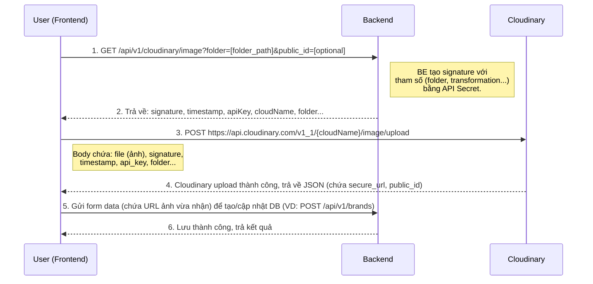

# Cấu Trúc Lưu Trữ & Quy Trình Upload Ảnh Cloudinary

Tài liệu này mô tả chi tiết cấu trúc thư mục lưu trữ ảnh trên Cloudinary dựa trên database của hệ thống Quản Lý Nhà Hàng, cũng như luồng xử lý upload ảnh từ Frontend đến Backend.

## 1. Cấu Trúc Thư Mục Cloudinary

Dựa trên cấu trúc database (Prisma) và hình ảnh thực tế, thư mục gốc trên Cloudinary là `quan_ly_nha_hang`. Bên trong, các thư mục được phân chia theo từng module và định danh (`id`) của đối tượng.

```text
quan_ly_nha_hang/
├── brands/
│   └── [brandId]/                 # ID của thương hiệu
│       ├── imageMain/             # Ảnh chính của thương hiệu
│       └── logo/                  # Logo của thương hiệu
├── restaurants/
│   └── [restaurantId]/            # ID của nhà hàng
│       ├── imageMain/             # Ảnh đại diện nhà hàng
│       ├── banner/                # Ảnh bìa (banner)
│       └── gallery/               # Danh sách ảnh liên quan đến nhà hàng
├── user/
│   └── [userId]/                  # ID của người dùng
│       └── avatar/                # Ảnh đại diện người dùng
├── menu_items/
│   └── [restaurantId]/            # Các món ăn theo nhà hàng
│       └── [itemId]/              # ID của món ăn
│           └── image/             # Ảnh của món ăn
└── promotions/
    └── [promotionId]/             # ID của chương trình khuyến mãi
        └── banner/                # Ảnh banner khuyến mãi
```

> **Ghi chú:** Khi FE gửi yêu cầu upload, tham số `folder` truyền lên phải tuân thủ đúng định dạng cấu trúc này (ví dụ: `folder=quan_ly_nha_hang/brands/69f5ce.../logo`).

---

## 2. Quy Trình Upload Ảnh (FE - BE - Cloudinary)

Hệ thống sử dụng cơ chế **Signed Upload** (Upload có chữ ký) để đảm bảo an toàn. Thay vì upload ảnh qua BE (gây tốn băng thông và chậm), FE sẽ lấy chữ ký từ BE và tải thẳng ảnh lên Cloudinary.

### Sơ Đồ Luồng Hoạt Động (Flow)



### Chi Tiết Từng Bước

#### Bước 1 & 2: Yêu cầu Chữ Ký (Signature) từ Backend
- **Frontend** gọi API GET đến Backend. API có thể là `/api/v1/cloudinary/image` (hoặc `/images` nếu lấy cho nhiều ảnh).
- Gửi kèm Query Parameters:
  - `folder`: Thư mục đích trên Cloudinary (vd: `quan_ly_nha_hang/brands/123/logo`).
  - `public_id`: (Tùy chọn) Tên file mong muốn, dùng khi muốn ghi đè hoặc đặt tên cố định.
- **Backend** (thông qua `cloudinarySignatureService.js`):
  - Lấy `timestamp` hiện tại.
  - Định nghĩa các tham số cần ký như `folder`, `transformation` (VD: `w_800,h_800,c_limit/q_auto,f_auto`).
  - Dùng `cloudinary.utils.api_sign_request` và `CLOUDINARY_API_SECRET` để tạo ra `signature`.
  - Trả về JSON cho FE gồm: `signature`, `timestamp`, `apiKey`, `cloudName`, `folder`,...

#### Bước 3 & 4: Upload trực tiếp lên Cloudinary từ Frontend
- **Frontend** nhận thông tin và tạo đối tượng `FormData`.
- Thêm file ảnh từ người dùng vào `FormData`.
- Thêm các thông tin bảo mật vào `FormData`: `api_key`, `timestamp`, `signature`, `folder`, `transformation` (các field này phải khớp **chính xác** với những gì BE đã dùng để tạo chữ ký).
- Gửi request `POST` đến API của Cloudinary: `https://api.cloudinary.com/v1_1/${cloudName}/image/upload`.
- **Cloudinary** xác thực chữ ký. Nếu hợp lệ, ảnh sẽ được lưu và trả về dữ liệu (quan trọng nhất là `secure_url`).

#### Bước 5 & 6: Lưu URL vào Database (Backend)
- **Frontend** nhận `secure_url` từ Cloudinary và gán URL này vào form data của ứng dụng (VD: biến `logoUrl` của form tạo Brand).
- Submit form này lên Backend để lưu vào database (SQL/MongoDB) bằng các module như `Brand`, `Restaurant`, `User`,...

---

## 3. Lợi ích của Cơ chế này
1. **Giảm tải Backend**: Backend không phải nhận, xử lý lưu tạm và upload lại file (rất tốn RAM và băng thông).
2. **Tốc độ cao**: Client upload song song trực tiếp lên server CDN của Cloudinary nhanh hơn.
3. **Bảo mật**: API Secret của Cloudinary luôn nằm ở Backend, không bị lộ cho Frontend. Chữ ký bảo đảm không ai có thể upload file rác bừa bãi vào Cloudinary của hệ thống.
