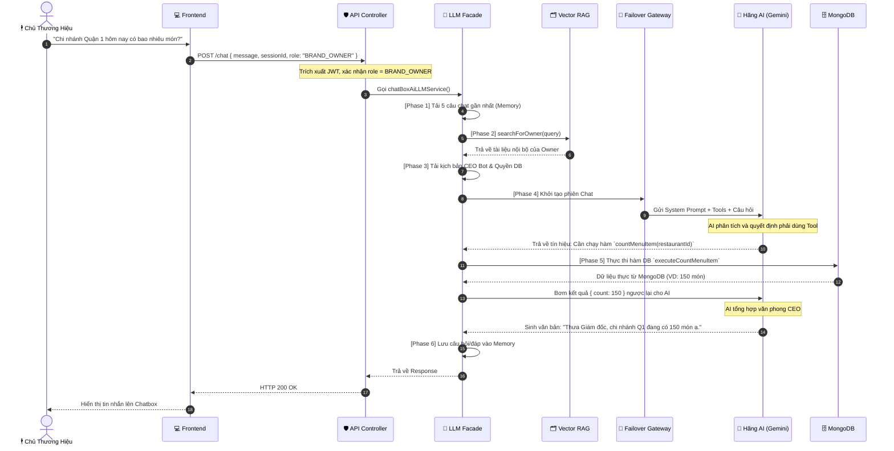

# 🌌 SƠ ĐỒ QUY TRÌNH HOẠT ĐỘNG AI CHATBOX (FE -> BE)

Tài liệu này mô phỏng trực quan dòng chảy dữ liệu (Data Flow) của hệ thống AI Chatbox dựa trên kiến trúc **Micro-Kernel**. Được thiết kế chuẩn để báo cáo trên GitHub hoặc thuyết trình dự án.

---

## 1. TỔNG QUAN KIẾN TRÚC MICRO-KERNEL (THE 6-PHASE ORCHESTRATOR)

Biểu đồ dưới đây thể hiện cách một yêu cầu từ người dùng (Frontend) được xử lý qua 6 bộ lọc (Phases) trong lõi Backend trước khi gửi đến Hãng AI (Google/OpenAI) và quay về.

```mermaid
graph TD
    %% Định nghĩa Style
    classDef frontend fill:#3b82f6,stroke:#2563eb,stroke-width:2px,color:#fff,rx:8px;
    classDef controller fill:#8b5cf6,stroke:#7c3aed,stroke-width:2px,color:#fff,rx:8px;
    classDef core fill:#10b981,stroke:#059669,stroke-width:2px,color:#fff,rx:8px;
    classDef provider fill:#f59e0b,stroke:#d97706,stroke-width:2px,color:#fff,rx:8px;
    classDef db fill:#ef4444,stroke:#dc2626,stroke-width:2px,color:#fff,rx:8px;

    %% Nodes
    FE["💻 Frontend (React)<br>Người dùng gửi tin nhắn"]:::frontend
    CTRL["🛡️ API Controller<br>(/api/v1/ai/chat)"]:::controller
    FACADE["🧠 LLM Facade<br>(Orchestrator Tối cao)"]:::core
    
    subgraph Lõi Vi Mô (Micro-Kernel Phases)
        MEM["Phase 1: Memory<br>Lấy Lịch sử Chat"]:::core
        RAG["Phase 2: RAG Engine<br>Tìm Ngữ cảnh (Vector)"]:::core
        PER["Phase 3: Persona<br>Cấp Quyền & Tính cách"]:::core
        GW["Phase 4: Gateway<br>Định tuyến Failover"]:::core
        ACT["Phase 5: Action<br>Thực thi Tool (DB)"]:::core
        SAVE["Phase 6: Save<br>Lưu Lịch sử mới"]:::core
    end

    LLM["🤖 LLM Provider<br>(Gemini / OpenAI)"]:::provider
    VDB["🗂️ Vector DB<br>(Pinecone)"]:::db
    MDB["🗄️ MongoDB<br>(Dữ liệu thực)"]:::db

    %% Luồng đi
    FE -->|"{ message, sessionId }"| CTRL
    CTRL -->|Xác thực Token & Phân tách Role| FACADE
    
    FACADE --> MEM
    MEM -.-> RAG
    RAG -->|Query ngữ cảnh| VDB
    VDB -->|Trả Document| RAG
    RAG -.-> PER
    PER -.-> GW
    GW -->|Gửi Prompt + Context + Tools| LLM
    LLM -->|Yêu cầu chạy Hàm (Function Call)| ACT
    ACT -->|Lấy số liệu thực| MDB
    MDB -->|Trả JSON| ACT
    ACT -->|Feed số liệu lại cho AI| LLM
    LLM -->|Sinh câu trả lời cuối cùng| SAVE
    SAVE -->|Lưu Session| CTRL
    CTRL -->|HTTP 200| FE
```

---

## 2. SEQUENCE DIAGRAM: LUỒNG CHI TIẾT (VÍ DỤ VỚI CHỦ THƯƠNG HIỆU)

Biểu đồ tuần tự (Sequence Diagram) thể hiện sự tương tác theo thời gian thực. Giả sử người dùng đang đăng nhập với quyền **Chủ Thương Hiệu (Owner)** và hỏi một câu liên quan đến số liệu nhà hàng.



---

## 3. CƠ CHẾ ĐỊNH TUYẾN CHỊU LỖI (FAILOVER ROUTER)

Sơ đồ mô phỏng tính năng "Không bao giờ sập" (High Availability) tại **Phase 4 (Gateway)**. Khi một hãng AI bị lỗi, hệ thống lập tức tự nhảy sang hãng dự phòng.

```mermaid
flowchart TD
    classDef success fill:#10b981,stroke:#059669,color:#fff,rx:8px;
    classDef fail fill:#ef4444,stroke:#dc2626,color:#fff,rx:8px;
    classDef process fill:#f59e0b,stroke:#d97706,color:#fff,rx:8px;

    IN[Request tới Gateway] --> SORT[Sắp xếp List API Keys theo ưu tiên]
    SORT --> LOOP{Vòng lặp Failover}
    
    LOOP -->|Thử Key 1 (VD: OpenAI)| API1[Gọi OpenAI SDK]:::process
    API1 -->|HTTP 429 Quota Exceeded| ERR1[Lỗi / Hết tiền]:::fail
    ERR1 -->|Bỏ qua, thử Key tiếp theo| LOOP
    
    LOOP -->|Thử Key 2 (VD: Gemini)| API2[Gọi Google SDK]:::process
    API2 -->|HTTP 503 Overloaded| ERR2[Server Hãng Bận]:::fail
    ERR2 -->|Bỏ qua, thử Key tiếp theo| LOOP
    
    LOOP -->|Thử Key 3 (Gemini Dự phòng)| API3[Gọi Google SDK]:::process
    API3 -->|HTTP 200| OK[Thành công]:::success
    
    OK --> AUDIT[Bắn Log trừ Quota (Bất đồng bộ)]
    OK --> OUT[Trả kết quả cho Facade]
```

> **GHI CHÚ:**
> Với kiến trúc này, 100% rủi ro tắc nghẽn hoặc lộ lọt dữ liệu đã được cô lập. Lập trình viên dễ dàng bảo trì hoặc mở rộng chức năng mà không sợ chạm mặt (Conflict) với các tính năng khác. Đạt tiêu chuẩn SaaS Enterprise.
