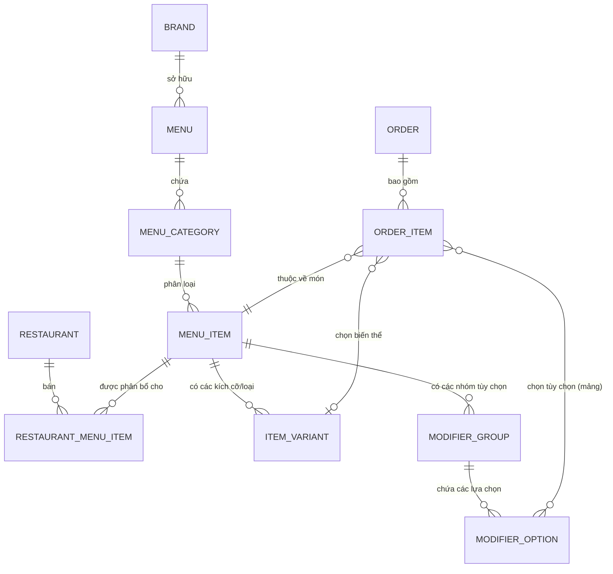

# Mối Quan Hệ Các Bảng và Luồng Tương Tác Hệ Thống Menu

Tài liệu này giải thích chi tiết mối liên kết (Relationships) giữa các Entity (Bảng) trong cơ sở dữ liệu liên quan đến Menu, đồng thời mô tả cách các vai trò (Roles) tương tác và thao tác (chẳng hạn như khi tạo món, đặt món).

---

## 1. Mối Quan Hệ Các Bảng (Table Relationships)

Kiến trúc Menu được thiết kế theo dạng cây phân cấp từ Thương hiệu (Brand) xuống đến từng Chi nhánh (Restaurant) và từng tùy chọn nhỏ nhất của món ăn.

### Giải thích các bảng cốt lõi:
1. **Menu**: Mỗi Brand thường có 1 Menu chính.
2. **MenuCategory**: Danh mục món ăn (Ví dụ: Khai vị, Món chính, Đồ uống).
3. **MenuItem**: Món ăn gốc (Ví dụ: Trà sữa Oolong).
4. **ItemVariant**: Các biến thể mang tính quyết định (Bắt buộc phải chọn 1 nếu có). Ví dụ: Size M, Size L. Mỗi biến thể có thể có giá riêng thay cho giá gốc (`basePrice`) của món.
5. **ModifierGroup**: Nhóm tùy chọn thêm. Cấu hình bằng `minSelections` và `maxSelections`. Ví dụ: "Lượng đá", "Topping thêm".
6. **ModifierOption**: Lựa chọn cụ thể trong nhóm. Mỗi lựa chọn có thể cộng thêm tiền (`priceExtra`). Ví dụ: Trân châu trắng (+10k).
7. **RestaurantMenuItem**: Bảng trung gian quy định Món ăn nào được bán ở Chi nhánh nào. Chứa trạng thái kho `isAvailable` và giá bán riêng `overridePrice`.

---

## 2. Luồng Tương Tác Của Các Vai Trò

Dưới đây là cách các User với vai trò khác nhau thao tác với hệ thống.

### A. Luồng Tạo Món (Dành cho BRAND OWNER)
*Brand Owner là người thiết kế Menu gốc.*

1. **Tạo Danh Mục (`MenuCategory`)**: Tạo danh mục "Đồ uống".
2. **Tạo Món Ăn (`MenuItem`)**: Tạo món "Trà sữa Oolong", đặt giá gốc là 30.000đ.
3. **Cấu hình Biến Thể (`ItemVariant`)**: 
   - Thêm "Size M" (Giá: 30.000đ)
   - Thêm "Size L" (Giá: 35.000đ)
4. **Cấu hình Nhóm Tùy Chọn (`ModifierGroup`)**:
   - **Nhóm "Lượng đá"**: Đặt `minSelections = 1`, `maxSelections = 1` (Bắt buộc chọn 1 và chỉ 1).
     - *Tạo Option*: 100% Đá (0đ), 50% Đá (0đ), Không đá (0đ).
   - **Nhóm "Topping"**: Đặt `minSelections = 0`, `maxSelections = 5` (Có thể không chọn, tối đa chọn 5).
     - *Tạo Option*: Trân châu (+5k), Thạch dừa (+10k), Kem Cheese (+15k).
5. **Phân bổ (`RestaurantMenuItem`)**: Đẩy món này xuống cho Chi nhánh Q1 và Chi nhánh Q3.

### B. Luồng Quản Lý Bán (Dành cho RESTAURANT MANAGER)
*Manager không tạo được món, chỉ quản lý trạng thái bán tại cửa hàng của mình.*

1. Hôm nay, Chi nhánh Q1 hết Trân châu -> Manager Q1 mở App, chọn ẩn (tạm ngưng) món Trà Sữa Oolong hoặc tắt tạm thời tùy chọn "Trân châu". Lúc này `isAvailable = false`.
2. Chi nhánh Q3 nằm ở khu sầm uất -> Manager Q3 (nếu được Brand cho phép) có thể chỉnh `overridePrice` (Giá tại chi nhánh) của Size M lên 32.000đ.

### C. Luồng Đặt Món / Order (Dành cho STAFF hoặc CUSTOMER)
*Khi Khách hoặc Nhân viên bấm vào món "Trà Sữa Oolong" để Order.*

Hệ thống sẽ render giao diện chọn món theo các quy tắc sau:

1. **Kiểm tra trạng thái**: Hệ thống check bảng `RestaurantMenuItem`, nếu `isAvailable == true` mới cho hiển thị.
2. **Chọn Món gốc (`MenuItem`)**: Khách chọn Trà sữa Oolong.
3. **Bắt buộc chọn Biến thể (`ItemVariant`)**:
   - Khách thấy 2 nút: `Size M (30k)` và `Size L (35k)`. Khách bắt buộc phải chọn 1.
   - *Khách chọn: Size L*. Lúc này giá tạm tính là 35.000đ.
4. **Render Nhóm Tùy Chọn (`ModifierGroup`)**:
   - Do nhóm "Lượng đá" có `maxSelections = 1`, hệ thống hiển thị **Radio Button**. Khách bắt buộc chọn 1 cái. *Khách chọn: 50% đá*.
   - Do nhóm "Topping" có `maxSelections > 1`, hệ thống hiển thị **Checkbox**. Khách có thể tick chọn nhiều. *Khách tick: Trân châu (+5k) và Kem Cheese (+15k)*.
5. **Tính Tiền (Order Calculation)**:
   - Khi thêm vào Giỏ hàng (`OrderItem`), dữ liệu lưu vào Database sẽ là:
     - `menuItemId`: [ID của Trà Sữa Oolong]
     - `variantId`: [ID của Size L]
     - `modifierOptionIds`: [ID_Đá_50%, ID_Trân_Châu, ID_Kem_Cheese]
   - **Tổng tiền món này** = [Giá Variant L: 35k] + [Đá: 0đ] + [Trân châu: 5k] + [Kem Cheese: 15k] = **55.000đ**.

### D. Luồng Tương Tác Bếp / Tồn Kho (Phase 2 - Mở Rộng)
- Nếu món ăn có gắn **Công thức (`Recipe`)**, khi Order 1 ly Trà sữa Oolong Size L + Trân châu, hệ thống sẽ tự động trừ trong Kho (`Ingredient`):
  - Trừ 200ml Trà Oolong (từ cấu hình Recipe của MenuItem).
  - Trừ 50g Đường (từ cấu hình Recipe của Variant Size L).
  - Trừ 20g Trân châu (từ cấu hình Recipe của ModifierOption Trân châu).
